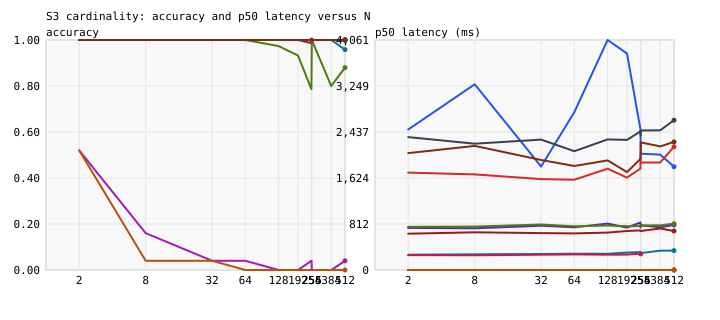

# DMB — decision-model benchmark

One narrow question: for a typed decision — pick one of N options and
state a calibrated confidence — what does each model class actually
deliver, at what latency, cost, and failure rate?

This repository answers it with an independent, reproducible
measurement. Three contender classes run under one frozen protocol:
jev (TypeSafe AI's "System One" decision model), eight constrained
LLMs across five providers, and three deterministic baselines. Five
suites, 60 cells, $28.34 of measured provider spend, every raw log
published. No vendor sponsorship; costs are paid, listed, and dated.

## What it found

| Contender | S1 banking 77-way | S2 spam | S3 code word | S4 permuted | Cost / 1k (S1) | p50 latency |
|---|---|---|---|---|---|---|
| jev | 76.3% | 93.0% | 100% to N=255, fails at 256+ | 76.7% | $0.07 | 264-276 ms |
| glm-5.3 | 80.4% | 94.9% | 100% | 82.0% | $2.42 | 2.4-5.6 s |
| glm-5.3-flash | 79.0% | 91.4% | 100% | 82.4% | $0.21 | 2.0-3.5 s |
| gpt-oss-120b (Cerebras) | 81.3% | 73.0% | 99.6% | 82.3% | $0.32 | 303-346 ms |
| deepseek-chat | 76.2% | 75.9% | 100% | 75.1% | $0.27 | 731-776 ms |
| claude-haiku-4.5 | 75.7% | 76.3% | 100% | 79.6% | $0.82 | 2.4-4.4 s |
| claude-sonnet-4.6 | 74.8% | 77.7% | 100% | 79.2% | $2.48 | 1.8-2.6 s |
| gpt-5.4-mini | 74.0% | 66.1% | 99.8% | 73.1% | $0.69 | 660-710 ms |
| gpt-5.4-nano | 70.9% | 67.3% | 93.2% | 68.6% | $0.19 | 684-782 ms |
| keyword baseline | 29.3% | 54.0% | 100% | 38.0% | $0.00 | 0 ms |
| majority baseline | 1.3% | 87.7% | 8.0% | 1.0% | $0.00 | 0 ms |
| random baseline | 1.7% | 53.7% | 5.5% | 2.7% | $0.00 | 0 ms |

Latency covers one request for these (v1) cells. Cost cells whose run
hit a retry are lower bounds; the reports mark them with `†`. The full
tables — coverage, calibration, macro-F1, flip rate, per-attempt logs —
are in [`results/v2/v2.md`](results/v2/v2.md), the corrected report of
record.

- **No class wins on quality.** The best banking-intent scores belong
  to gpt-oss-120b (81.3%) and glm-5.3 (80.4%); jev lands mid-pack
  (76.3%). On spam the GLM models lead (94.9%, 91.4%); two OpenAI
  models sit below the 87.7% majority baseline.
- **Fastest measured — not 40-200x.** jev's p50 is 264-276 ms, flat
  from 2 to 255 options: 1.2x faster than gpt-oss-120b on Cerebras,
  10-16x faster than the thinking-mode models. The vendor's speedup
  claim holds only against LLMs left in their slowest default mode.
- **The 255-choice cap is real and sharp.** At 254 and 255 options jev
  answers with 100% accuracy. At 256, 384, and 512 it rejects the
  request: `400 Too many choices.` Every LLM handles 512 options.
- **Only jev bluffs.** On forced-uncertainty items, every LLM admits
  ignorance on 97.3-100% of them. jev admits on 49.7%, with the worst
  calibration error measured (ECE 0.246; the LLMs range 0.039-0.122).
- **Position bias is a measurable axis.** Rerun the same items with
  permuted option order: jev changes 13% of its choices, the worst LLM
  37%. Vendor evaluations do not measure this.
- **Cheapest by ten times.** $0.07 per 1,000 decisions on the banking
  suite; the cheapest LLM costs $0.19.



## Where everything lives

- [`SPEC.md`](SPEC.md) — full design: contenders, suites, metrics,
  protocol, budget, and the protocol history (v1 versus v2).
- [`results/v2/`](results/v2/) — corrected report: `v2.md`, `v2.html`,
  `v2.cells.json` (machine-readable), plots, the scrubbed raw archive,
  and [`CORRECTIONS.md`](results/v2/CORRECTIONS.md), which maps every
  corrected number to the defect that produced the old one.
- `results/v1*`, `results/v1.1*` — original releases, unchanged.
- [`blog/v1-post.md`](blog/v1-post.md) — the post drafted for
  nibzard.com; it quotes the corrected numbers.
- `src/dmb/` — adapters for every contender, the runner, the metrics,
  and the report generator. `tests/` — 143 tests, no network needed.

## Reproduce it

You need Python 3.12, `uv`, and API keys for the contenders you want
(`OPENAI_API_KEY`, `ANTHROPIC_AUTH_TOKEN`, `ZAI_API_KEY`,
`DEEPSEEK_API_KEY`, `CEREBRAS_API_KEY`, `TYPESAFE_API_KEY` for jev).
Missing keys skip that contender and record the skip.

1. Clone and install: `uv sync`.
1. Build the suite items: `uv run dmb build`. Item files download,
   build, and hash; they rebuild byte-identical from the pinned seed.
   Compare your hashes against the published manifests.
1. Smoke run: `uv run dmb run --run-id smoke --smoke` — 50 items per
   suite, one repeat, every available contender.
1. Report: `uv run dmb report runs/smoke --out results`.
1. Tests: `uv run pytest`.

The full grid is `uv run dmb run --run-id v3`. Budget it first: the
published v1 grid cost $28.14; the soft cap is $40 and the runner
aborts at a $60 hard cap.

## Run IDs and exit codes

A run ID is one directory name: no slashes, no `.`, and not empty. The
runner reserves `runs/<id>` exclusively at start. If the directory
exists, the run refuses to start with exit code 2 — nothing is resumed,
merged, or overwritten. Use a new run ID and let the report merge cells.

`dmb run` exits 0 for a complete run. Exit 2 is a usage error: an
invalid or taken run ID, or no contenders available. Exit 3 is an
execution failure, 4 a budget stop, 5 an authentication stop, and 6 a
deadline stop. A stopped or failed run keeps its partial results, its
attempt logs, and a terminal manifest status.

## Merging runs in a report

`dmb report` verifies every supplied run before combining anything:
item-file hashes must match each manifest, conflicting hashes for one
suite are rejected, and rows are validated against the frozen items.
Later runs replace earlier cells whole — a later failed cell replaces
an earlier success instead of falling back to it. Every coverage row
names its source run. Runs whose protocol versions differ are rejected
unless you pass `--allow-protocol-mix`; the report then records the
mix visibly.

The corrected v2 report was produced with:

```bash
uv run dmb run --run-id v2-majority-fix --suites s1_intent77,s4_order \
  --contenders baseline:majority --repeats 3 --no-negotiate
uv run dmb report runs/v1 --extra runs/v1.1 --extra runs/v2-majority-fix \
  --allow-protocol-mix --correction-note results/v2/CORRECTIONS.md \
  --name v2 --out results/v2
```

## What each command writes

- `data/suites/*.jsonl` — frozen items plus `hashes.json`; byte-identical
  on rebuild (pinned seed).
- `runs/<id>/manifest.json` — protocol, item-file hashes, price-table
  hash, library versions, spend, per-cell status, deviations, skips.
- `runs/<id>/prices.snapshot.json` — the exact price table the run was
  billed against; reports reprice from it.
- `runs/<id>/results.jsonl` — one row per item per repeat.
- `runs/<id>/raw/*.jsonl` — full attempt logs with provider responses,
  plus one attempt record per request in `*.attempts.jsonl`.
- `results/<name>.md`, `results/<name>.html` — generated report; never
  hand-edited.
- `results/<name>-raw.tar.gz` — raw archive; SMS spam state text is
  scrubbed (that license does not cover republication).

## Honesty rules

1. No vendor sponsorship. Costs are paid, listed, and dated.
1. The protocol is frozen before the full run. Deviations are recorded
   in the manifest, not edited silently.
1. Negative results ship. A contender that loses stays in the table.
1. Raw logs publish with the report. Anyone can recompute every number.
1. Unknown usage is never reported as a measured zero. Cost cells mark
   what their number covers and what is missing.

## Data sources

- S1 banking77 — PolyAI banking77 dataset, CC BY 4.0.
- S2 SMS spam — UCI SMS Spam Collection; item text stays local and is
  scrubbed from every published archive.
- S3, S4, S5 — synthetic, seeded, rebuilt byte-identical from source.

jev stayed out of the first published release (v1) and landed in v1.1.
The v2 report corrects the defects listed in
[`results/v2/CORRECTIONS.md`](results/v2/CORRECTIONS.md).
