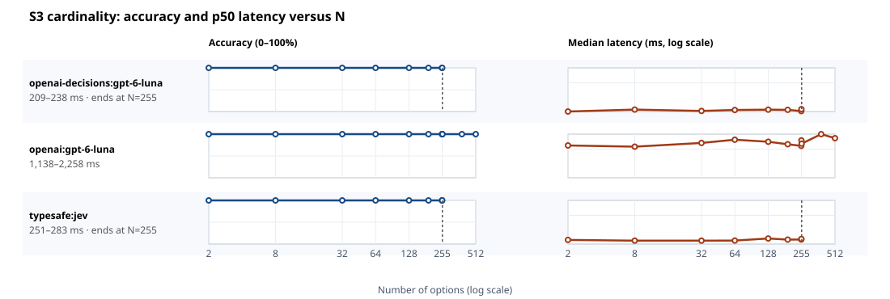
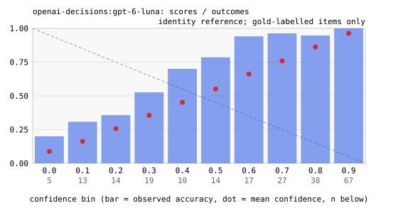
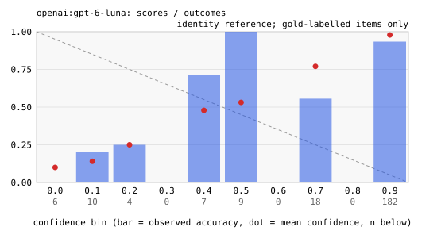
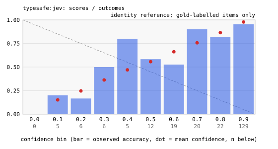

# Decision-model benchmark: results

Runs: decisions-preview-controls, decisions-preview-decisions.
Source manifests record $0.05 in total (historical totals may use nominal rates or incomplete usage). Recomputed known subtotal for selected cells: $0.05. This is not a complete bill where accounting is marked incomplete.

Every number in this file recomputes from `results.jsonl` and the
manifests in the raw archive. Later runs replace earlier cells
whole; each coverage row names its source run.

Denominators:

- Accuracy and macro-F1 cover valid decisions on gold-labelled items.
  General ECE/Brier use that subset too; S5 no-good diagnostics are separate.
- Completion coverage is completed decisions divided by expected
  decisions; valid coverage is valid decisions divided by expected
  decisions.
- Malformed and failed rates use completed decisions as the
  denominator.
- Cost covers the attempt charges each cell's `cost_scope` names;
  unknown usage is never treated as a measured zero.
- Latency covers the complete decision: first attempt through final outcome, including retry backoff.

## Protocol and data caveats

- Cost caveats: some cells report incomplete usage. Unknown usage is not a measured zero; see the cost table markers and the coverage table.
- Confidence semantics differ: LLM scores are prompted probabilities; jev's native score is provider-defined and has not been established as probability of correctness. ECE/Brier for native scores are score-to-outcome diagnostics, not proof of dishonesty or comparable probability calibration.
- S5 legacy ECE/Brier fields cover only underdetermined items with synthetic hidden labels. Separate no-good diagnostics include every valid forced choice as wrong. Scores <= 0.5 are a descriptive cutoff, not an honesty verdict.
- S4 overall flips combine repeat nondeterminism and option-order variation. Within-order and across-order rates use complete blocks with equal observation counts and fixed repeat matching; missing blocks are excluded and counted in the JSON. Across-order disagreement alone does not establish a causal position effect.
- Item-cluster bootstrap intervals use 2,000 deterministic resamples, equal item weights, and S4 base items as clusters. Pairwise differences use common observed items. Repeated responses are not independent examples; intervals do not cover missingness or dataset shift and pairwise intervals are not multiplicity-adjusted.
- Risk/coverage points in the JSON use fixed, unfitted score cutoffs and expected decisions as the coverage denominator. They describe these observations only. Selecting a deployment threshold requires a separate held-out calibration/evaluation split; no deployment cutoff is recommended here.

## Run notes

- [decisions-preview-controls] Free-text provider/run diagnostics are omitted by S2 publication policy; structured protocol and configuration metadata remain.
- [decisions-preview-decisions] Free-text provider/run diagnostics are omitted by S2 publication policy; structured protocol and configuration metadata remain.

## Coverage (expected versus completed decisions)

| contender | suite | status | expected | completed | valid | malformed | failed | completion % | valid % | stop reason | source run |
|---|---|---|---|---|---|---|---|---|---|---|---|
| openai-decisions:gpt-6-luna | S1 intent77 (77-way banking) | ok | 77 | 77 | 77 | 0 | 0 | 100.0 | 100.0 |  | decisions-preview-decisions |
| openai-decisions:gpt-6-luna | S2 SMS spam (2-way) | ok | 50 | 50 | 50 | 0 | 0 | 100.0 | 100.0 |  | decisions-preview-decisions |
| openai-decisions:gpt-6-luna | S3 cardinality sweep | ok | 44 | 44 | 32 | 0 | 12 | 100.0 | 72.7 |  | decisions-preview-decisions |
| openai-decisions:gpt-6-luna | S4 order stability | ok | 45 | 45 | 45 | 0 | 0 | 100.0 | 100.0 |  | decisions-preview-decisions |
| openai-decisions:gpt-6-luna | S5 forced uncertainty (score diagnostics) | ok | 40 | 40 | 36 | 4 | 0 | 100.0 | 90.0 |  | decisions-preview-decisions |
| openai:gpt-6-luna | S1 intent77 (77-way banking) | ok | 77 | 77 | 77 | 0 | 0 | 100.0 | 100.0 |  | decisions-preview-controls |
| openai:gpt-6-luna | S2 SMS spam (2-way) | ok | 50 | 50 | 50 | 0 | 0 | 100.0 | 100.0 |  | decisions-preview-controls |
| openai:gpt-6-luna | S3 cardinality sweep | ok | 44 | 44 | 44 | 0 | 0 | 100.0 | 100.0 |  | decisions-preview-controls |
| openai:gpt-6-luna | S4 order stability | ok | 45 | 45 | 45 | 0 | 0 | 100.0 | 100.0 |  | decisions-preview-controls |
| openai:gpt-6-luna | S5 forced uncertainty (score diagnostics) | ok | 40 | 40 | 40 | 0 | 0 | 100.0 | 100.0 |  | decisions-preview-controls |
| typesafe:jev | S1 intent77 (77-way banking) | ok | 77 | 77 | 77 | 0 | 0 | 100.0 | 100.0 |  | decisions-preview-controls |
| typesafe:jev | S2 SMS spam (2-way) | ok | 50 | 50 | 50 | 0 | 0 | 100.0 | 100.0 |  | decisions-preview-controls |
| typesafe:jev | S3 cardinality sweep | ok | 44 | 44 | 32 | 0 | 12 | 100.0 | 72.7 |  | decisions-preview-controls |
| typesafe:jev | S4 order stability | ok | 45 | 45 | 45 | 0 | 0 | 100.0 | 100.0 |  | decisions-preview-controls |
| typesafe:jev | S5 forced uncertainty (score diagnostics) | ok | 40 | 40 | 40 | 0 | 0 | 100.0 | 100.0 |  | decisions-preview-controls |

A cell is partial when it stopped early or returned malformed or
failed decisions. Empty, failed, and skipped cells stay listed
with their reasons.

## Accuracy (percent, valid rows, gold items) (*: partial coverage; see the coverage table)

| contender | S1 intent77 (77-way banking) | S2 SMS spam (2-way) | S3 cardinality sweep | S4 order stability | S5 forced uncertainty (score diagnostics) |
|---|---|---|---|---|---|
| openai-decisions:gpt-6-luna | 76.6 | 100.0 | 100.0* | 88.9 | 10.0* |
| openai:gpt-6-luna | 84.4 | 90.0 | 100.0 | 88.9 | 15.0 |
| typesafe:jev | 83.1 | 98.0 | 100.0* | 86.7 | 5.0 |

## Macro-F1 (stable option labels; absent classes count as 0) (*: partial coverage; see the coverage table). Not applicable on S3 and S5: their option texts vary between items, so positions are not classes

| contender | S1 intent77 (77-way banking) | S2 SMS spam (2-way) | S3 cardinality sweep | S4 order stability | S5 forced uncertainty (score diagnostics) |
|---|---|---|---|---|---|
| openai-decisions:gpt-6-luna | 0.708 | 1.000 | n/a | 0.171 | n/a |
| openai:gpt-6-luna | 0.812 | 0.823 | n/a | 0.172 | n/a |
| typesafe:jev | 0.788 | 0.956 | n/a | 0.165 | n/a |

## ECE diagnostic (gold-labelled only; S5 underdetermined only)

| contender | S1 intent77 (77-way banking) | S2 SMS spam (2-way) | S3 cardinality sweep | S4 order stability | S5 forced uncertainty (score diagnostics) |
|---|---|---|---|---|---|
| openai-decisions:gpt-6-luna | 0.155 | 0.101 | 0.192 | 0.210 | 0.182 |
| openai:gpt-6-luna | 0.089 | 0.208 | 0.000 | 0.051 | 0.060 |
| typesafe:jev | 0.067 | 0.161 | 0.023 | 0.126 | 0.345 |

## Brier diagnostic (gold-labelled only; S5 underdetermined only)

| contender | S1 intent77 (77-way banking) | S2 SMS spam (2-way) | S3 cardinality sweep | S4 order stability | S5 forced uncertainty (score diagnostics) |
|---|---|---|---|---|---|
| openai-decisions:gpt-6-luna | 0.147 | 0.024 | 0.088 | 0.168 | 0.106 |
| openai:gpt-6-luna | 0.111 | 0.155 | 0.000 | 0.080 | 0.121 |
| typesafe:jev | 0.130 | 0.083 | 0.003 | 0.123 | 0.193 |

## Malformed rate (percent of completed decisions)

| contender | S1 intent77 (77-way banking) | S2 SMS spam (2-way) | S3 cardinality sweep | S4 order stability | S5 forced uncertainty (score diagnostics) |
|---|---|---|---|---|---|
| openai-decisions:gpt-6-luna | 0.0 | 0.0 | 0.0 | 0.0 | 10.0 |
| openai:gpt-6-luna | 0.0 | 0.0 | 0.0 | 0.0 | 0.0 |
| typesafe:jev | 0.0 | 0.0 | 0.0 | 0.0 | 0.0 |

## Failed attempts (rate, percent of completed decisions)

| contender | S1 intent77 (77-way banking) | S2 SMS spam (2-way) | S3 cardinality sweep | S4 order stability | S5 forced uncertainty (score diagnostics) |
|---|---|---|---|---|---|
| openai-decisions:gpt-6-luna | 0.0 | 0.0 | 27.3 | 0.0 | 0.0 |
| openai:gpt-6-luna | 0.0 | 0.0 | 0.0 | 0.0 | 0.0 |
| typesafe:jev | 0.0 | 0.0 | 27.3 | 0.0 | 0.0 |

## Latency p50 (ms)

| contender | S1 intent77 (77-way banking) | S2 SMS spam (2-way) | S3 cardinality sweep | S4 order stability | S5 forced uncertainty (score diagnostics) |
|---|---|---|---|---|---|
| openai-decisions:gpt-6-luna | 225 | 224 | 227 | 239 | 215 |
| openai:gpt-6-luna | 1,362 | 1,228 | 1,340 | 1,279 | 1,313 |
| typesafe:jev | 264 | 252 | 261 | 263 | 277 |

## Latency p95 (ms)

| contender | S1 intent77 (77-way banking) | S2 SMS spam (2-way) | S3 cardinality sweep | S4 order stability | S5 forced uncertainty (score diagnostics) |
|---|---|---|---|---|---|
| openai-decisions:gpt-6-luna | 575 | 470 | 302 | 539 | 455 |
| openai:gpt-6-luna | 2,117 | 2,872 | 2,823 | 3,144 | 1,765 |
| typesafe:jev | 318 | 282 | 322 | 318 | 351 |

## Latency p99 (ms)

| contender | S1 intent77 (77-way banking) | S2 SMS spam (2-way) | S3 cardinality sweep | S4 order stability | S5 forced uncertainty (score diagnostics) |
|---|---|---|---|---|---|
| openai-decisions:gpt-6-luna | 1,227 | 843 | 341 | 1,555 | 531 |
| openai:gpt-6-luna | 3,106 | 3,645 | 3,345 | 4,196 | 2,480 |
| typesafe:jev | 468 | 334 | 426 | 358 | 360 |

## Known cost per 1,000 completed decisions (USD) (†: incomplete usage; see the coverage table)

| contender | S1 intent77 (77-way banking) | S2 SMS spam (2-way) | S3 cardinality sweep | S4 order stability | S5 forced uncertainty (score diagnostics) |
|---|---|---|---|---|---|
| openai-decisions:gpt-6-luna | $0.11 | $0.02 | $0.08† | $0.11 | $0.02 |
| openai:gpt-6-luna | $0.09 | $0.03 | $0.17 | $0.09 | $0.03 |
| typesafe:jev | $0.08 | $0.02 | $0.06† | $0.08 | $0.02 |

## S4 overall flip rate (all repeats and orders; percent of observed bases)

| contender | S4 order stability |
|---|---|
| openai-decisions:gpt-6-luna | 6.7 |
| openai:gpt-6-luna | 13.3 |
| typesafe:jev | 0.0 |

## S4 mean confidence range across all repeats and orders

| contender | S4 order stability |
|---|---|
| openai-decisions:gpt-6-luna | 0.277 |
| openai:gpt-6-luna | 0.079 |
| typesafe:jev | 0.077 |

## S5 score <= 0.5 on no-good items (percent; score semantics differ)

| contender | S5 forced uncertainty (score diagnostics) |
|---|---|
| openai-decisions:gpt-6-luna | 93.8 |
| openai:gpt-6-luna | 100.0 |
| typesafe:jev | 55.0 |

## S5 mean confidence on no-good items

| contender | S5 forced uncertainty (score diagnostics) |
|---|---|
| openai-decisions:gpt-6-luna | 0.319 |
| openai:gpt-6-luna | 0.022 |
| typesafe:jev | 0.533 |

## S4 within-order repeat disagreement (complete matched blocks, percent)

| contender | S4 order stability |
|---|---|
| openai-decisions:gpt-6-luna | - |
| openai:gpt-6-luna | - |
| typesafe:jev | - |

## S4 across-order disagreement (complete matched-repeat blocks, percent)

| contender | S4 order stability |
|---|---|
| openai-decisions:gpt-6-luna | - |
| openai:gpt-6-luna | - |
| typesafe:jev | - |

## S5 no-good ECE diagnostic (every valid choice is wrong)

| contender | S5 forced uncertainty (score diagnostics) |
|---|---|
| openai-decisions:gpt-6-luna | 0.319 |
| openai:gpt-6-luna | 0.022 |
| typesafe:jev | 0.533 |

## S5 no-good Brier diagnostic (every valid choice is wrong)

| contender | S5 forced uncertainty (score diagnostics) |
|---|---|
| openai-decisions:gpt-6-luna | 0.116 |
| openai:gpt-6-luna | 0.004 |
| typesafe:jev | 0.369 |

## Cost accounting completeness

| contender | suite | complete | scope | limitation |
|---|---|---|---|---|
| openai-decisions:gpt-6-luna | s1_intent77 | yes | every recorded attempt of this cell |  |
| openai-decisions:gpt-6-luna | s2_spam | yes | every recorded attempt of this cell |  |
| openai-decisions:gpt-6-luna | s3_cardinality | no | every recorded attempt of this cell | missing or invalid token usage |
| openai-decisions:gpt-6-luna | s4_order | yes | every recorded attempt of this cell |  |
| openai-decisions:gpt-6-luna | s5_confidence | yes | every recorded attempt of this cell |  |
| openai:gpt-6-luna | s1_intent77 | yes | every recorded attempt of this cell |  |
| openai:gpt-6-luna | s2_spam | yes | every recorded attempt of this cell |  |
| openai:gpt-6-luna | s3_cardinality | yes | every recorded attempt of this cell |  |
| openai:gpt-6-luna | s4_order | yes | every recorded attempt of this cell |  |
| openai:gpt-6-luna | s5_confidence | yes | every recorded attempt of this cell |  |
| typesafe:jev | s1_intent77 | yes | every recorded attempt of this cell |  |
| typesafe:jev | s2_spam | yes | every recorded attempt of this cell |  |
| typesafe:jev | s3_cardinality | no | every recorded attempt of this cell | missing or invalid token usage |
| typesafe:jev | s4_order | yes | every recorded attempt of this cell |  |
| typesafe:jev | s5_confidence | yes | every recorded attempt of this cell |  |

## Descriptive accuracy interval (equal item weights, 95% cluster bootstrap, percent)

| contender | suite | clusters | item mean | lower | upper |
|---|---|---|---|---|---|
| openai-decisions:gpt-6-luna | s1_intent77 | 77 | 76.6 | 66.2 | 85.7 |
| openai-decisions:gpt-6-luna | s2_spam | 50 | 100.0 | 100.0 | 100.0 |
| openai-decisions:gpt-6-luna | s3_cardinality | 32 | 100.0 | 100.0 | 100.0 |
| openai-decisions:gpt-6-luna | s4_order | 15 | 88.9 | 73.3 | 100.0 |
| openai-decisions:gpt-6-luna | s5_confidence | 20 | 10.0 | 0.0 | 25.0 |
| openai:gpt-6-luna | s1_intent77 | 77 | 84.4 | 76.6 | 92.2 |
| openai:gpt-6-luna | s2_spam | 50 | 90.0 | 82.0 | 98.0 |
| openai:gpt-6-luna | s3_cardinality | 44 | 100.0 | 100.0 | 100.0 |
| openai:gpt-6-luna | s4_order | 15 | 88.9 | 73.3 | 100.0 |
| openai:gpt-6-luna | s5_confidence | 20 | 15.0 | 0.0 | 35.0 |
| typesafe:jev | s1_intent77 | 77 | 83.1 | 74.0 | 90.9 |
| typesafe:jev | s2_spam | 50 | 98.0 | 94.0 | 100.0 |
| typesafe:jev | s3_cardinality | 32 | 100.0 | 100.0 | 100.0 |
| typesafe:jev | s4_order | 15 | 86.7 | 66.7 | 100.0 |
| typesafe:jev | s5_confidence | 20 | 5.0 | 0.0 | 15.0 |

## S4 comparison coverage (missing blocks are excluded)

| contender | observations/block | within complete | within missing | across complete | across missing |
|---|---|---|---|---|---|
| openai-decisions:gpt-6-luna | 0 | 0 | 0 | 0 | 0 |
| openai:gpt-6-luna | 0 | 0 | 0 | 0 | 0 |
| typesafe:jev | 0 | 0 | 0 | 0 | 0 |

## S5 diagnostic denominators (valid decisions only)

| contender | subset | items | valid decisions |
|---|---|---|---|
| openai-decisions:gpt-6-luna | no_good_option | 16 | 16 |
| openai-decisions:gpt-6-luna | underdetermined | 20 | 20 |
| openai:gpt-6-luna | no_good_option | 20 | 20 |
| openai:gpt-6-luna | underdetermined | 20 | 20 |
| typesafe:jev | no_good_option | 20 | 20 |
| typesafe:jev | underdetermined | 20 | 20 |

## Cardinality (S3)

## Reliability diagrams

### openai-decisions:gpt-6-luna

### openai:gpt-6-luna

### typesafe:jev

## Machine-readable cell metrics

See `decisions-preview-comparison-2026-10-07.cells.json` next to this file.

## Data and licenses

- banking77 (S1, S4 base items): PolyAI, CC BY 4.0; intent labels
  appear in the raw logs with this attribution.
- UCI SMS spam (S2): UCI currently identifies the collection as CC BY 4.0
  (https://archive.ics.uci.edu/dataset/228/sms+spam+collection). Text stays
  local under this project's conservative publication policy.
- S3, S5 are synthetic and generated by this repository's code
  from seed 20260918.

