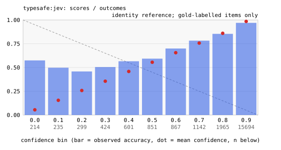

# Decision-model benchmark: results

Runs: expanded-test-jev-20260929.
Source manifests record $1.07 in total (historical totals may use nominal rates or incomplete usage). Recomputed known subtotal for selected cells: $1.07. This is not a complete bill where accounting is marked incomplete.

Every number in this file recomputes from `results.jsonl` and the
manifests in the raw archive. Later runs replace earlier cells
whole; each coverage row names its source run.

Denominators:

- Accuracy and macro-F1 cover valid decisions on gold-labelled items.
  General ECE/Brier use that subset too; S5 no-good diagnostics are separate.
- Completion coverage is completed decisions divided by expected
  decisions; valid coverage is valid decisions divided by expected
  decisions.
- Malformed and failed rates use completed decisions as the
  denominator.
- Cost covers the attempt charges each cell's `cost_scope` names;
  unknown usage is never treated as a measured zero.
- Latency covers the complete decision: first attempt through final outcome, including retry backoff.

## Protocol and data caveats

- Confidence semantics differ: LLM scores are prompted probabilities; jev's native score is provider-defined and has not been established as probability of correctness. ECE/Brier for native scores are score-to-outcome diagnostics, not proof of dishonesty or comparable probability calibration.
- S5 legacy ECE/Brier fields cover only underdetermined items with synthetic hidden labels. Separate no-good diagnostics include every valid forced choice as wrong. Scores <= 0.5 are a descriptive cutoff, not an honesty verdict.
- S4 overall flips combine repeat nondeterminism and option-order variation. Within-order and across-order rates use complete blocks with equal observation counts and fixed repeat matching; missing blocks are excluded and counted in the JSON. Across-order disagreement alone does not establish a causal position effect.
- Item-cluster bootstrap intervals use 2,000 deterministic resamples, equal item weights, and S4 base items as clusters. Pairwise differences use common observed items. Repeated responses are not independent examples; intervals do not cover missingness or dataset shift and pairwise intervals are not multiplicity-adjusted.
- Risk/coverage points in the JSON use fixed, unfitted score cutoffs and expected decisions as the coverage denominator. They describe these observations only. Selecting a deployment threshold requires a separate held-out calibration/evaluation split; no deployment cutoff is recommended here.

## Run notes

- [expanded-test-jev-20260929] no skips
- [expanded-test-jev-20260929] negotiate=True
- [expanded-test-jev-20260929] contender filter: ['typesafe:jev']

## Coverage (expected versus completed decisions)

| contender | suite | status | expected | completed | valid | malformed | failed | completion % | valid % | stop reason | source run |
|---|---|---|---|---|---|---|---|---|---|---|---|
| typesafe:jev | S6 Banking77 official split (test) | ok | 3080 | 3080 | 3080 | 0 | 0 | 100.0 | 100.0 |  | expanded-test-jev-20260929 |
| typesafe:jev | S7 CLINC150 with out-of-scope (test) | ok | 5500 | 5500 | 5500 | 0 | 0 | 100.0 | 100.0 |  | expanded-test-jev-20260929 |
| typesafe:jev | S8 NLU++ binary intent questions (test) | ok | 13712 | 13712 | 13712 | 0 | 0 | 100.0 | 100.0 |  | expanded-test-jev-20260929 |

A cell is partial when it stopped early or returned malformed or
failed decisions. Empty, failed, and skipped cells stay listed
with their reasons.

## S6–S8 correct decisions / all requested (%)

| contender | S6 Banking77 official split (test) | S7 CLINC150 with out-of-scope (test) | S8 NLU++ binary intent questions (test) |
|---|---|---|---|
| typesafe:jev | 79.2 | 88.6 | 91.4 |

## S7 out-of-scope precision (%)

| contender | S7 CLINC150 with out-of-scope (test) |
|---|---|
| typesafe:jev | 90.3 |

## S7 out-of-scope recall (all requested positives, %)

| contender | S7 CLINC150 with out-of-scope (test) |
|---|---|
| typesafe:jev | 81.2 |

## S7 in-scope correct / all requested in-scope (%)

| contender | S7 CLINC150 with out-of-scope (test) |
|---|---|
| typesafe:jev | 90.3 |

## S8 micro intent F1 (%)

| contender | S8 NLU++ binary intent questions (test) |
|---|---|
| typesafe:jev | 48.3 |

## S8 macro intent F1 (absent intents count as zero, %)

| contender | S8 NLU++ binary intent questions (test) |
|---|---|
| typesafe:jev | 58.1 |

## S8 complete-message accuracy (all labels correct, %)

| contender | S8 NLU++ binary intent questions (test) |
|---|---|
| typesafe:jev | 4.3 |

## S8 complete-message valid coverage (%)

| contender | S8 NLU++ binary intent questions (test) |
|---|---|
| typesafe:jev | 100.0 |

## Accuracy (percent, valid rows, gold items) (*: partial coverage; see the coverage table)

| contender | S6 Banking77 official split (test) | S7 CLINC150 with out-of-scope (test) | S8 NLU++ binary intent questions (test) |
|---|---|---|---|
| typesafe:jev | 79.2 | 88.6 | 91.4 |

## Macro-F1 (stable option labels; absent classes count as 0) (*: partial coverage; see the coverage table). Not applicable on S3 and S5: their option texts vary between items, so positions are not classes

| contender | S6 Banking77 official split (test) | S7 CLINC150 with out-of-scope (test) | S8 NLU++ binary intent questions (test) |
|---|---|---|---|
| typesafe:jev | 0.784 | 0.890 | 0.718 |

## ECE diagnostic (gold-labelled only; S5 underdetermined only)

| contender | S6 Banking77 official split (test) | S7 CLINC150 with out-of-scope (test) | S8 NLU++ binary intent questions (test) |
|---|---|---|---|
| typesafe:jev | 0.068 | 0.023 | 0.047 |

## Brier diagnostic (gold-labelled only; S5 underdetermined only)

| contender | S6 Banking77 official split (test) | S7 CLINC150 with out-of-scope (test) | S8 NLU++ binary intent questions (test) |
|---|---|---|---|
| typesafe:jev | 0.124 | 0.080 | 0.074 |

## Malformed rate (percent of completed decisions)

| contender | S6 Banking77 official split (test) | S7 CLINC150 with out-of-scope (test) | S8 NLU++ binary intent questions (test) |
|---|---|---|---|
| typesafe:jev | 0.0 | 0.0 | 0.0 |

## Failed attempts (rate, percent of completed decisions)

| contender | S6 Banking77 official split (test) | S7 CLINC150 with out-of-scope (test) | S8 NLU++ binary intent questions (test) |
|---|---|---|---|
| typesafe:jev | 0.0 | 0.0 | 0.0 |

## Latency p50 (ms)

| contender | S6 Banking77 official split (test) | S7 CLINC150 with out-of-scope (test) | S8 NLU++ binary intent questions (test) |
|---|---|---|---|
| typesafe:jev | 316 | 279 | 267 |

## Latency p95 (ms)

| contender | S6 Banking77 official split (test) | S7 CLINC150 with out-of-scope (test) | S8 NLU++ binary intent questions (test) |
|---|---|---|---|
| typesafe:jev | 570 | 416 | 333 |

## Latency p99 (ms)

| contender | S6 Banking77 official split (test) | S7 CLINC150 with out-of-scope (test) | S8 NLU++ binary intent questions (test) |
|---|---|---|---|
| typesafe:jev | 769 | 564 | 407 |

## Known cost per 1,000 completed decisions (USD) (†: incomplete usage; see the coverage table)

| contender | S6 Banking77 official split (test) | S7 CLINC150 with out-of-scope (test) | S8 NLU++ binary intent questions (test) |
|---|---|---|---|
| typesafe:jev | $0.08 | $0.11 | $0.02 |

## Cost accounting completeness

| contender | suite | complete | scope | limitation |
|---|---|---|---|---|
| typesafe:jev | s6_banking77_test | yes | every recorded attempt of this cell |  |
| typesafe:jev | s7_clinc150_test | yes | every recorded attempt of this cell |  |
| typesafe:jev | s8_nlupp_test | yes | every recorded attempt of this cell |  |

## Descriptive accuracy interval (equal item weights, 95% cluster bootstrap, percent)

| contender | suite | clusters | item mean | lower | upper |
|---|---|---|---|---|---|
| typesafe:jev | s6_banking77_test | 3080 | 79.2 | 77.8 | 80.6 |
| typesafe:jev | s7_clinc150_test | 5500 | 88.6 | 87.7 | 89.5 |
| typesafe:jev | s8_nlupp_test | 302 | 91.4 | 90.8 | 92.0 |

## Reliability diagrams

### typesafe:jev

## Machine-readable cell metrics

See `expanded-test-jev-20260929.cells.json` next to this file.

## Data and licenses

- banking77 (S1, S4 base items): PolyAI, CC BY 4.0; intent labels
  appear in the raw logs with this attribution.
- UCI SMS spam (S2): UCI currently identifies the collection as CC BY 4.0
  (https://archive.ics.uci.edu/dataset/228/sms+spam+collection). Text stays
  local under this project's conservative publication policy.
- S3, S5 are synthetic and generated by this repository's code
  from seed 20260918.

- S6 Banking77 and S8 NLU++: PolyAI, CC BY 4.0.
  https://github.com/PolyAI-LDN/task-specific-datasets
- S7 CLINC150: Larson et al. (2019), CC BY 3.0.
  https://github.com/clinc/oos-eval
- S8 adapts the intent task into binary Choice requests. Complete-message
  accuracy requires all intent decisions, including absent intents, to be correct.
  Missing answers count against coverage and complete-message accuracy.
  Micro/macro intent F1 count missing positive labels as missed positives.
  A limit that cuts a message cannot produce a complete answer for that message.
- S8 latency is per binary request; native Noul and batched questions are not tested.
  The validation/test fold selection differs from published NLU++ evaluations.
