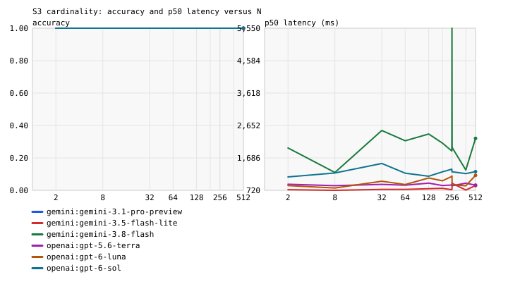
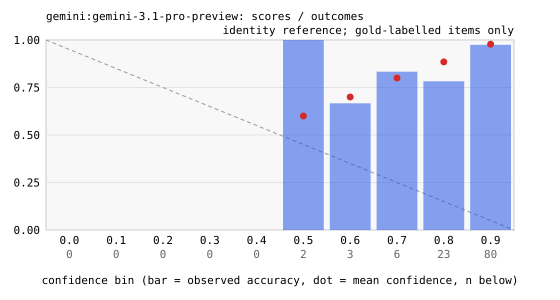
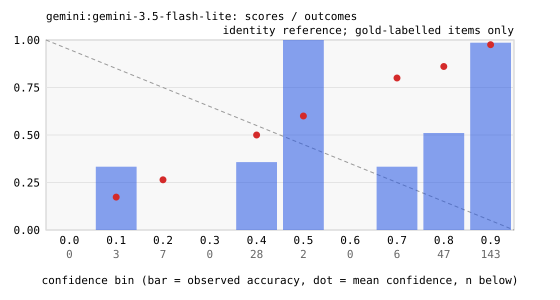
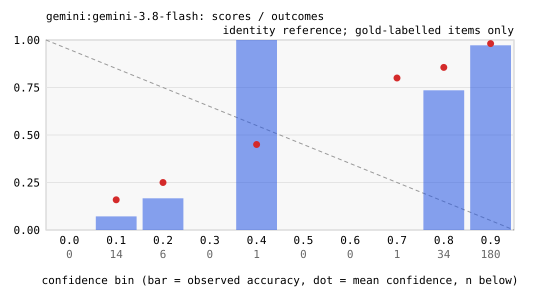
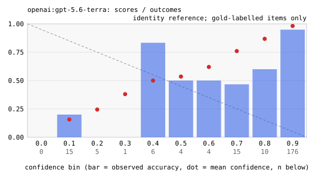
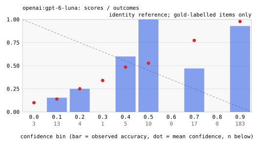
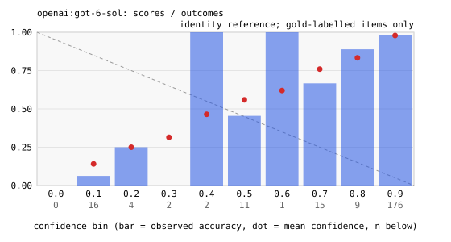

# Decision-model benchmark: results

Runs: recent-pilot-2026-09-26, recent-pilot-2026-09-26-pro-paced.
Source manifests record $1.85 in total (historical totals may use nominal rates or incomplete usage). Recomputed known subtotal for selected cells: $1.48. This is not a complete bill where accounting is marked incomplete.

Every number in this file recomputes from `results.jsonl` and the
manifests in the raw archive. Later runs replace earlier cells
whole; each coverage row names its source run.

Denominators:

- Accuracy and macro-F1 cover valid decisions on gold-labelled items.
  General ECE/Brier use that subset too; S5 no-good diagnostics are separate.
- Completion coverage is completed decisions divided by expected
  decisions; valid coverage is valid decisions divided by expected
  decisions.
- Malformed and failed rates use completed decisions as the
  denominator.
- Cost covers the attempt charges each cell's `cost_scope` names;
  unknown usage is never treated as a measured zero.
- Latency covers the complete decision: first attempt through final outcome, including retry backoff.

## Correction note

## Recent-model pilot

one per Banking77 intent; SMS prior preserved; four per cardinality; 15 S4 bases/all three orders; 20 items from each S5 half.

small stratified pilot, one repeat; no repeat-stability inference; S1 macro-F1 has one reference item per intent; S4 has only 15 bases; not mergeable with historical full-suite runs.

Minimum supported reasoning settings are pinned per endpoint. Costs use dated standard paid-tier list rates; Gemini account tier/invoices are not reconciled. No tools, grounding, or explicit cache storage are requested. Astra is excluded. All started attempts and probes count toward the shared cap.

Gemini Pro originally exceeded this account's 25 RPM quota. Its five cells are replaced by a rerun attempt with one worker and requests at least 3 seconds apart. Pro latency includes pacing and is not a like-for-like speed comparison. Both runs are retained in the archive. Original known spend: $1.54354597; rerun known spend: $0.30424000; combined: $1.84778597. Usage-less 429 responses leave an accounting qualification; these figures are known list-price costs, not an invoice reconciliation.

The paced Pro rerun was interrupted after hitting a separate 250 requests/day quota (API retry delay about six hours). It yielded 114 valid decisions, including all 77 banking items and 37 SMS items. The other five models each completed all 256 decisions successfully. The first Pro run yielded 135 valid decisions across the five suites; those original observations remain available in the original-run report and archive. The merged report replaces whole Pro cells with the rerun, including interrupted or unstarted cells, rather than selecting favorable individual answers. No claim of a completed six-model comparison is made.

## Protocol and data caveats

- Cost caveats: some cells report incomplete usage. Unknown usage is not a measured zero; see the cost table markers and the coverage table.
- Confidence semantics differ: LLM scores are prompted probabilities; jev's native score is provider-defined and has not been established as probability of correctness. ECE/Brier for native scores are score-to-outcome diagnostics, not proof of dishonesty or comparable probability calibration.
- S5 legacy ECE/Brier fields cover only underdetermined items with synthetic hidden labels. Separate no-good diagnostics include every valid forced choice as wrong. Scores <= 0.5 are a descriptive cutoff, not an honesty verdict.
- S4 overall flips combine repeat nondeterminism and option-order variation. Within-order and across-order rates use complete blocks with equal observation counts and fixed repeat matching; missing blocks are excluded and counted in the JSON. Across-order disagreement alone does not establish a causal position effect.
- Item-cluster bootstrap intervals use 2,000 deterministic resamples, equal item weights, and S4 base items as clusters. Pairwise differences use common observed items. Repeated responses are not independent examples; intervals do not cover missingness or dataset shift and pairwise intervals are not multiplicity-adjusted.
- Risk/coverage points in the JSON use fixed, unfitted score cutoffs and expected decisions as the coverage denominator. They describe these observations only. Selecting a deployment threshold requires a separate held-out calibration/evaluation split; no deployment cutoff is recommended here.

## Run notes

- [recent-pilot-2026-09-26] Free-text provider/run diagnostics are omitted by S2 publication policy; structured protocol and configuration metadata remain.
- [recent-pilot-2026-09-26-pro-paced] Free-text provider/run diagnostics are omitted by S2 publication policy; structured protocol and configuration metadata remain.

## Coverage (expected versus completed decisions)

| contender | suite | status | expected | completed | valid | malformed | failed | completion % | valid % | stop reason | source run |
|---|---|---|---|---|---|---|---|---|---|---|---|
| gemini:gemini-3.1-pro-preview | S1 intent77 (77-way banking) | ok | 77 | 77 | 77 | 0 | 0 | 100.0 | 100.0 |  | recent-pilot-2026-09-26-pro-paced |
| gemini:gemini-3.1-pro-preview | S2 SMS spam (2-way) | ok | 50 | 50 | 37 | 0 | 13 | 100.0 | 74.0 |  | recent-pilot-2026-09-26-pro-paced |
| gemini:gemini-3.1-pro-preview | S3 cardinality sweep | stopped | 44 | 4 | 0 | 0 | 4 | 9.1 | 0.0 | interrupted by user | recent-pilot-2026-09-26-pro-paced |
| gemini:gemini-3.1-pro-preview | S4 order stability | skipped | 45 | 0 | 0 | 0 | 0 | 0.0 | 0.0 | interrupted by user | recent-pilot-2026-09-26-pro-paced |
| gemini:gemini-3.1-pro-preview | S5 forced uncertainty (score diagnostics) | skipped | 40 | 0 | 0 | 0 | 0 | 0.0 | 0.0 | interrupted by user | recent-pilot-2026-09-26-pro-paced |
| gemini:gemini-3.5-flash-lite | S1 intent77 (77-way banking) | ok | 77 | 77 | 77 | 0 | 0 | 100.0 | 100.0 |  | recent-pilot-2026-09-26 |
| gemini:gemini-3.5-flash-lite | S2 SMS spam (2-way) | ok | 50 | 50 | 50 | 0 | 0 | 100.0 | 100.0 |  | recent-pilot-2026-09-26 |
| gemini:gemini-3.5-flash-lite | S3 cardinality sweep | ok | 44 | 44 | 44 | 0 | 0 | 100.0 | 100.0 |  | recent-pilot-2026-09-26 |
| gemini:gemini-3.5-flash-lite | S4 order stability | ok | 45 | 45 | 45 | 0 | 0 | 100.0 | 100.0 |  | recent-pilot-2026-09-26 |
| gemini:gemini-3.5-flash-lite | S5 forced uncertainty (score diagnostics) | ok | 40 | 40 | 40 | 0 | 0 | 100.0 | 100.0 |  | recent-pilot-2026-09-26 |
| gemini:gemini-3.8-flash | S1 intent77 (77-way banking) | ok | 77 | 77 | 77 | 0 | 0 | 100.0 | 100.0 |  | recent-pilot-2026-09-26 |
| gemini:gemini-3.8-flash | S2 SMS spam (2-way) | ok | 50 | 50 | 50 | 0 | 0 | 100.0 | 100.0 |  | recent-pilot-2026-09-26 |
| gemini:gemini-3.8-flash | S3 cardinality sweep | ok | 44 | 44 | 44 | 0 | 0 | 100.0 | 100.0 |  | recent-pilot-2026-09-26 |
| gemini:gemini-3.8-flash | S4 order stability | ok | 45 | 45 | 45 | 0 | 0 | 100.0 | 100.0 |  | recent-pilot-2026-09-26 |
| gemini:gemini-3.8-flash | S5 forced uncertainty (score diagnostics) | ok | 40 | 40 | 40 | 0 | 0 | 100.0 | 100.0 |  | recent-pilot-2026-09-26 |
| openai:gpt-5.6-terra | S1 intent77 (77-way banking) | ok | 77 | 77 | 77 | 0 | 0 | 100.0 | 100.0 |  | recent-pilot-2026-09-26 |
| openai:gpt-5.6-terra | S2 SMS spam (2-way) | ok | 50 | 50 | 50 | 0 | 0 | 100.0 | 100.0 |  | recent-pilot-2026-09-26 |
| openai:gpt-5.6-terra | S3 cardinality sweep | ok | 44 | 44 | 44 | 0 | 0 | 100.0 | 100.0 |  | recent-pilot-2026-09-26 |
| openai:gpt-5.6-terra | S4 order stability | ok | 45 | 45 | 45 | 0 | 0 | 100.0 | 100.0 |  | recent-pilot-2026-09-26 |
| openai:gpt-5.6-terra | S5 forced uncertainty (score diagnostics) | ok | 40 | 40 | 40 | 0 | 0 | 100.0 | 100.0 |  | recent-pilot-2026-09-26 |
| openai:gpt-6-luna | S1 intent77 (77-way banking) | ok | 77 | 77 | 77 | 0 | 0 | 100.0 | 100.0 |  | recent-pilot-2026-09-26 |
| openai:gpt-6-luna | S2 SMS spam (2-way) | ok | 50 | 50 | 50 | 0 | 0 | 100.0 | 100.0 |  | recent-pilot-2026-09-26 |
| openai:gpt-6-luna | S3 cardinality sweep | ok | 44 | 44 | 44 | 0 | 0 | 100.0 | 100.0 |  | recent-pilot-2026-09-26 |
| openai:gpt-6-luna | S4 order stability | ok | 45 | 45 | 45 | 0 | 0 | 100.0 | 100.0 |  | recent-pilot-2026-09-26 |
| openai:gpt-6-luna | S5 forced uncertainty (score diagnostics) | ok | 40 | 40 | 40 | 0 | 0 | 100.0 | 100.0 |  | recent-pilot-2026-09-26 |
| openai:gpt-6-sol | S1 intent77 (77-way banking) | ok | 77 | 77 | 77 | 0 | 0 | 100.0 | 100.0 |  | recent-pilot-2026-09-26 |
| openai:gpt-6-sol | S2 SMS spam (2-way) | ok | 50 | 50 | 50 | 0 | 0 | 100.0 | 100.0 |  | recent-pilot-2026-09-26 |
| openai:gpt-6-sol | S3 cardinality sweep | ok | 44 | 44 | 44 | 0 | 0 | 100.0 | 100.0 |  | recent-pilot-2026-09-26 |
| openai:gpt-6-sol | S4 order stability | ok | 45 | 45 | 45 | 0 | 0 | 100.0 | 100.0 |  | recent-pilot-2026-09-26 |
| openai:gpt-6-sol | S5 forced uncertainty (score diagnostics) | ok | 40 | 40 | 40 | 0 | 0 | 100.0 | 100.0 |  | recent-pilot-2026-09-26 |

A cell is partial when it stopped early or returned malformed or
failed decisions. Empty, failed, and skipped cells stay listed
with their reasons.

## Accuracy (percent, valid rows, gold items) (*: partial coverage; see the coverage table)

| contender | S1 intent77 (77-way banking) | S2 SMS spam (2-way) | S3 cardinality sweep | S4 order stability | S5 forced uncertainty (score diagnostics) |
|---|---|---|---|---|---|
| gemini:gemini-3.1-pro-preview | 88.3 | 100.0* | - | - | - |
| gemini:gemini-3.5-flash-lite | 77.9 | 66.0 | 100.0 | 86.7 | 20.0 |
| gemini:gemini-3.8-flash | 88.3 | 100.0 | 100.0 | 86.7 | 10.0 |
| openai:gpt-5.6-terra | 88.3 | 76.0 | 100.0 | 86.7 | 15.0 |
| openai:gpt-6-luna | 80.5 | 90.0 | 100.0 | 88.9 | 15.0 |
| openai:gpt-6-sol | 85.7 | 94.0 | 100.0 | 93.3 | 10.0 |

## Macro-F1 (stable option labels; absent classes count as 0) (*: partial coverage; see the coverage table). Not applicable on S3 and S5: their option texts vary between items, so positions are not classes

| contender | S1 intent77 (77-way banking) | S2 SMS spam (2-way) | S3 cardinality sweep | S4 order stability | S5 forced uncertainty (score diagnostics) |
|---|---|---|---|---|---|
| gemini:gemini-3.1-pro-preview | 0.846 | 1.000* | n/a | - | n/a |
| gemini:gemini-3.5-flash-lite | 0.723 | 0.587 | n/a | 0.168 | n/a |
| gemini:gemini-3.8-flash | 0.851 | 1.000 | n/a | 0.171 | n/a |
| openai:gpt-5.6-terra | 0.851 | 0.650 | n/a | 0.165 | n/a |
| openai:gpt-6-luna | 0.764 | 0.823 | n/a | 0.172 | n/a |
| openai:gpt-6-sol | 0.827 | 0.882 | n/a | 0.182 | n/a |

## ECE diagnostic (gold-labelled only; S5 underdetermined only)

| contender | S1 intent77 (77-way banking) | S2 SMS spam (2-way) | S3 cardinality sweep | S4 order stability | S5 forced uncertainty (score diagnostics) |
|---|---|---|---|---|---|
| gemini:gemini-3.1-pro-preview | 0.060 | 0.036 | - | - | - |
| gemini:gemini-3.5-flash-lite | 0.165 | 0.153 | 0.000 | 0.080 | 0.216 |
| gemini:gemini-3.8-flash | 0.065 | 0.013 | 0.000 | 0.061 | 0.086 |
| openai:gpt-5.6-terra | 0.049 | 0.187 | 0.000 | 0.131 | 0.094 |
| openai:gpt-6-luna | 0.126 | 0.183 | 0.000 | 0.050 | 0.025 |
| openai:gpt-6-sol | 0.083 | 0.055 | 0.000 | 0.052 | 0.063 |

## Brier diagnostic (gold-labelled only; S5 underdetermined only)

| contender | S1 intent77 (77-way banking) | S2 SMS spam (2-way) | S3 cardinality sweep | S4 order stability | S5 forced uncertainty (score diagnostics) |
|---|---|---|---|---|---|
| gemini:gemini-3.1-pro-preview | 0.101 | 0.005 | - | - | - |
| gemini:gemini-3.5-flash-lite | 0.163 | 0.188 | 0.000 | 0.109 | 0.184 |
| gemini:gemini-3.8-flash | 0.100 | 0.001 | 0.000 | 0.108 | 0.100 |
| openai:gpt-5.6-terra | 0.080 | 0.193 | 0.000 | 0.095 | 0.136 |
| openai:gpt-6-luna | 0.134 | 0.141 | 0.000 | 0.082 | 0.122 |
| openai:gpt-6-sol | 0.092 | 0.040 | 0.000 | 0.041 | 0.091 |

## Malformed rate (percent of completed decisions)

| contender | S1 intent77 (77-way banking) | S2 SMS spam (2-way) | S3 cardinality sweep | S4 order stability | S5 forced uncertainty (score diagnostics) |
|---|---|---|---|---|---|
| gemini:gemini-3.1-pro-preview | 0.0 | 0.0 | 0.0 | - | - |
| gemini:gemini-3.5-flash-lite | 0.0 | 0.0 | 0.0 | 0.0 | 0.0 |
| gemini:gemini-3.8-flash | 0.0 | 0.0 | 0.0 | 0.0 | 0.0 |
| openai:gpt-5.6-terra | 0.0 | 0.0 | 0.0 | 0.0 | 0.0 |
| openai:gpt-6-luna | 0.0 | 0.0 | 0.0 | 0.0 | 0.0 |
| openai:gpt-6-sol | 0.0 | 0.0 | 0.0 | 0.0 | 0.0 |

## Failed attempts (rate, percent of completed decisions)

| contender | S1 intent77 (77-way banking) | S2 SMS spam (2-way) | S3 cardinality sweep | S4 order stability | S5 forced uncertainty (score diagnostics) |
|---|---|---|---|---|---|
| gemini:gemini-3.1-pro-preview | 0.0 | 26.0 | 100.0 | - | - |
| gemini:gemini-3.5-flash-lite | 0.0 | 0.0 | 0.0 | 0.0 | 0.0 |
| gemini:gemini-3.8-flash | 0.0 | 0.0 | 0.0 | 0.0 | 0.0 |
| openai:gpt-5.6-terra | 0.0 | 0.0 | 0.0 | 0.0 | 0.0 |
| openai:gpt-6-luna | 0.0 | 0.0 | 0.0 | 0.0 | 0.0 |
| openai:gpt-6-sol | 0.0 | 0.0 | 0.0 | 0.0 | 0.0 |

## Latency p50 (ms)

| contender | S1 intent77 (77-way banking) | S2 SMS spam (2-way) | S3 cardinality sweep | S4 order stability | S5 forced uncertainty (score diagnostics) |
|---|---|---|---|---|---|
| gemini:gemini-3.1-pro-preview | 3,070 | 3,118 | - | - | - |
| gemini:gemini-3.5-flash-lite | 779 | 771 | 764 | 737 | 761 |
| gemini:gemini-3.8-flash | 1,332 | 1,343 | 1,983 | 1,482 | 1,900 |
| openai:gpt-5.6-terra | 1,011 | 940 | 880 | 953 | 967 |
| openai:gpt-6-luna | 956 | 854 | 985 | 952 | 879 |
| openai:gpt-6-sol | 1,333 | 1,116 | 1,255 | 1,271 | 1,245 |

## Latency p95 (ms)

| contender | S1 intent77 (77-way banking) | S2 SMS spam (2-way) | S3 cardinality sweep | S4 order stability | S5 forced uncertainty (score diagnostics) |
|---|---|---|---|---|---|
| gemini:gemini-3.1-pro-preview | 4,758 | 4,067 | - | - | - |
| gemini:gemini-3.5-flash-lite | 930 | 1,017 | 915 | 893 | 945 |
| gemini:gemini-3.8-flash | 2,786 | 4,000 | 5,539 | 2,996 | 6,462 |
| openai:gpt-5.6-terra | 1,209 | 1,189 | 983 | 1,201 | 1,166 |
| openai:gpt-6-luna | 1,358 | 1,206 | 1,249 | 1,299 | 1,127 |
| openai:gpt-6-sol | 2,113 | 1,374 | 1,589 | 2,074 | 1,539 |

## Latency p99 (ms)

| contender | S1 intent77 (77-way banking) | S2 SMS spam (2-way) | S3 cardinality sweep | S4 order stability | S5 forced uncertainty (score diagnostics) |
|---|---|---|---|---|---|
| gemini:gemini-3.1-pro-preview | 5,560 | 4,513 | - | - | - |
| gemini:gemini-3.5-flash-lite | 1,116 | 1,071 | 989 | 1,084 | 1,020 |
| gemini:gemini-3.8-flash | 5,335 | 10,383 | 10,729 | 14,927 | 7,223 |
| openai:gpt-5.6-terra | 1,364 | 1,229 | 1,283 | 1,805 | 1,226 |
| openai:gpt-6-luna | 2,058 | 1,314 | 1,503 | 1,538 | 1,228 |
| openai:gpt-6-sol | 2,791 | 1,533 | 1,899 | 2,183 | 1,867 |

## Known cost per 1,000 completed decisions (USD) (†: incomplete usage; see the coverage table)

| contender | S1 intent77 (77-way banking) | S2 SMS spam (2-way) | S3 cardinality sweep | S4 order stability | S5 forced uncertainty (score diagnostics) |
|---|---|---|---|---|---|
| gemini:gemini-3.1-pro-preview | $3.27 | $1.02† | - | - | - |
| gemini:gemini-3.5-flash-lite | $0.34 | $0.09 | $0.53 | $0.34 | $0.10 |
| gemini:gemini-3.8-flash | $0.97 | $0.31 | $1.38 | $0.91 | $0.61 |
| openai:gpt-5.6-terra | $1.85 | $0.65 | $3.46 | $1.84 | $0.69 |
| openai:gpt-6-luna | $0.09 | $0.03 | $0.17 | $0.09 | $0.03 |
| openai:gpt-6-sol | $1.80 | $0.60 | $3.41 | $1.80 | $0.65 |

## S4 overall flip rate (all repeats and orders; percent of observed bases)

| contender | S4 order stability |
|---|---|
| gemini:gemini-3.1-pro-preview | - |
| gemini:gemini-3.5-flash-lite | 13.3 |
| gemini:gemini-3.8-flash | 13.3 |
| openai:gpt-5.6-terra | 0.0 |
| openai:gpt-6-luna | 13.3 |
| openai:gpt-6-sol | 13.3 |

## S4 mean confidence range across all repeats and orders

| contender | S4 order stability |
|---|---|
| gemini:gemini-3.1-pro-preview | - |
| gemini:gemini-3.5-flash-lite | 0.048 |
| gemini:gemini-3.8-flash | 0.023 |
| openai:gpt-5.6-terra | 0.055 |
| openai:gpt-6-luna | 0.056 |
| openai:gpt-6-sol | 0.052 |

## S5 score <= 0.5 on no-good items (percent; score semantics differ)

| contender | S5 forced uncertainty (score diagnostics) |
|---|---|
| gemini:gemini-3.1-pro-preview | - |
| gemini:gemini-3.5-flash-lite | 100.0 |
| gemini:gemini-3.8-flash | 100.0 |
| openai:gpt-5.6-terra | 100.0 |
| openai:gpt-6-luna | 95.0 |
| openai:gpt-6-sol | 100.0 |

## S5 mean confidence on no-good items

| contender | S5 forced uncertainty (score diagnostics) |
|---|---|
| gemini:gemini-3.1-pro-preview | - |
| gemini:gemini-3.5-flash-lite | 0.114 |
| gemini:gemini-3.8-flash | 0.220 |
| openai:gpt-5.6-terra | 0.058 |
| openai:gpt-6-luna | 0.082 |
| openai:gpt-6-sol | 0.150 |

## S4 within-order repeat disagreement (complete matched blocks, percent)

| contender | S4 order stability |
|---|---|
| gemini:gemini-3.1-pro-preview | - |
| gemini:gemini-3.5-flash-lite | - |
| gemini:gemini-3.8-flash | - |
| openai:gpt-5.6-terra | - |
| openai:gpt-6-luna | - |
| openai:gpt-6-sol | - |

## S4 across-order disagreement (complete matched-repeat blocks, percent)

| contender | S4 order stability |
|---|---|
| gemini:gemini-3.1-pro-preview | - |
| gemini:gemini-3.5-flash-lite | - |
| gemini:gemini-3.8-flash | - |
| openai:gpt-5.6-terra | - |
| openai:gpt-6-luna | - |
| openai:gpt-6-sol | - |

## S5 no-good ECE diagnostic (every valid choice is wrong)

| contender | S5 forced uncertainty (score diagnostics) |
|---|---|
| gemini:gemini-3.1-pro-preview | - |
| gemini:gemini-3.5-flash-lite | 0.113 |
| gemini:gemini-3.8-flash | 0.220 |
| openai:gpt-5.6-terra | 0.058 |
| openai:gpt-6-luna | 0.083 |
| openai:gpt-6-sol | 0.150 |

## S5 no-good Brier diagnostic (every valid choice is wrong)

| contender | S5 forced uncertainty (score diagnostics) |
|---|---|
| gemini:gemini-3.1-pro-preview | - |
| gemini:gemini-3.5-flash-lite | 0.022 |
| gemini:gemini-3.8-flash | 0.053 |
| openai:gpt-5.6-terra | 0.004 |
| openai:gpt-6-luna | 0.054 |
| openai:gpt-6-sol | 0.032 |

## Cost accounting completeness

| contender | suite | complete | scope | limitation |
|---|---|---|---|---|
| gemini:gemini-3.1-pro-preview | s1_intent77 | yes | every recorded attempt of this cell |  |
| gemini:gemini-3.1-pro-preview | s2_spam | no | every recorded attempt of this cell | missing or invalid token usage |
| gemini:gemini-3.1-pro-preview | s3_cardinality | no | every recorded attempt of this cell | missing or invalid token usage |
| gemini:gemini-3.1-pro-preview | s4_order | no | final-attempt usage of completed decisions | no billable-attempt observations available |
| gemini:gemini-3.1-pro-preview | s5_confidence | no | final-attempt usage of completed decisions | no billable-attempt observations available |
| gemini:gemini-3.5-flash-lite | s1_intent77 | yes | every recorded attempt of this cell |  |
| gemini:gemini-3.5-flash-lite | s2_spam | yes | every recorded attempt of this cell |  |
| gemini:gemini-3.5-flash-lite | s3_cardinality | yes | every recorded attempt of this cell |  |
| gemini:gemini-3.5-flash-lite | s4_order | yes | every recorded attempt of this cell |  |
| gemini:gemini-3.5-flash-lite | s5_confidence | yes | every recorded attempt of this cell |  |
| gemini:gemini-3.8-flash | s1_intent77 | yes | every recorded attempt of this cell |  |
| gemini:gemini-3.8-flash | s2_spam | yes | every recorded attempt of this cell |  |
| gemini:gemini-3.8-flash | s3_cardinality | yes | every recorded attempt of this cell |  |
| gemini:gemini-3.8-flash | s4_order | yes | every recorded attempt of this cell |  |
| gemini:gemini-3.8-flash | s5_confidence | yes | every recorded attempt of this cell |  |
| openai:gpt-5.6-terra | s1_intent77 | yes | every recorded attempt of this cell |  |
| openai:gpt-5.6-terra | s2_spam | yes | every recorded attempt of this cell |  |
| openai:gpt-5.6-terra | s3_cardinality | yes | every recorded attempt of this cell |  |
| openai:gpt-5.6-terra | s4_order | yes | every recorded attempt of this cell |  |
| openai:gpt-5.6-terra | s5_confidence | yes | every recorded attempt of this cell |  |
| openai:gpt-6-luna | s1_intent77 | yes | every recorded attempt of this cell |  |
| openai:gpt-6-luna | s2_spam | yes | every recorded attempt of this cell |  |
| openai:gpt-6-luna | s3_cardinality | yes | every recorded attempt of this cell |  |
| openai:gpt-6-luna | s4_order | yes | every recorded attempt of this cell |  |
| openai:gpt-6-luna | s5_confidence | yes | every recorded attempt of this cell |  |
| openai:gpt-6-sol | s1_intent77 | yes | every recorded attempt of this cell |  |
| openai:gpt-6-sol | s2_spam | yes | every recorded attempt of this cell |  |
| openai:gpt-6-sol | s3_cardinality | yes | every recorded attempt of this cell |  |
| openai:gpt-6-sol | s4_order | yes | every recorded attempt of this cell |  |
| openai:gpt-6-sol | s5_confidence | yes | every recorded attempt of this cell |  |

## Descriptive accuracy interval (equal item weights, 95% cluster bootstrap, percent)

| contender | suite | clusters | item mean | lower | upper |
|---|---|---|---|---|---|
| gemini:gemini-3.1-pro-preview | s1_intent77 | 77 | 88.3 | 81.8 | 94.8 |
| gemini:gemini-3.1-pro-preview | s2_spam | 37 | 100.0 | 100.0 | 100.0 |
| gemini:gemini-3.5-flash-lite | s1_intent77 | 77 | 77.9 | 68.8 | 87.0 |
| gemini:gemini-3.5-flash-lite | s2_spam | 50 | 66.0 | 52.0 | 80.0 |
| gemini:gemini-3.5-flash-lite | s3_cardinality | 44 | 100.0 | 100.0 | 100.0 |
| gemini:gemini-3.5-flash-lite | s4_order | 15 | 86.7 | 71.1 | 100.0 |
| gemini:gemini-3.5-flash-lite | s5_confidence | 20 | 20.0 | 5.0 | 40.0 |
| gemini:gemini-3.8-flash | s1_intent77 | 77 | 88.3 | 80.5 | 94.8 |
| gemini:gemini-3.8-flash | s2_spam | 50 | 100.0 | 100.0 | 100.0 |
| gemini:gemini-3.8-flash | s3_cardinality | 44 | 100.0 | 100.0 | 100.0 |
| gemini:gemini-3.8-flash | s4_order | 15 | 86.7 | 73.3 | 100.0 |
| gemini:gemini-3.8-flash | s5_confidence | 20 | 10.0 | 0.0 | 25.0 |
| openai:gpt-5.6-terra | s1_intent77 | 77 | 88.3 | 81.8 | 94.8 |
| openai:gpt-5.6-terra | s2_spam | 50 | 76.0 | 64.0 | 88.0 |
| openai:gpt-5.6-terra | s3_cardinality | 44 | 100.0 | 100.0 | 100.0 |
| openai:gpt-5.6-terra | s4_order | 15 | 86.7 | 66.7 | 100.0 |
| openai:gpt-5.6-terra | s5_confidence | 20 | 15.0 | 0.0 | 30.0 |
| openai:gpt-6-luna | s1_intent77 | 77 | 80.5 | 71.4 | 89.6 |
| openai:gpt-6-luna | s2_spam | 50 | 90.0 | 82.0 | 98.0 |
| openai:gpt-6-luna | s3_cardinality | 44 | 100.0 | 100.0 | 100.0 |
| openai:gpt-6-luna | s4_order | 15 | 88.9 | 73.3 | 100.0 |
| openai:gpt-6-luna | s5_confidence | 20 | 15.0 | 0.0 | 35.0 |
| openai:gpt-6-sol | s1_intent77 | 77 | 85.7 | 77.9 | 93.5 |
| openai:gpt-6-sol | s2_spam | 50 | 94.0 | 86.0 | 100.0 |
| openai:gpt-6-sol | s3_cardinality | 44 | 100.0 | 100.0 | 100.0 |
| openai:gpt-6-sol | s4_order | 15 | 93.3 | 82.2 | 100.0 |
| openai:gpt-6-sol | s5_confidence | 20 | 10.0 | 0.0 | 25.0 |

## S4 comparison coverage (missing blocks are excluded)

| contender | observations/block | within complete | within missing | across complete | across missing |
|---|---|---|---|---|---|
| gemini:gemini-3.1-pro-preview | 0 | 0 | 0 | 0 | 0 |
| gemini:gemini-3.5-flash-lite | 0 | 0 | 0 | 0 | 0 |
| gemini:gemini-3.8-flash | 0 | 0 | 0 | 0 | 0 |
| openai:gpt-5.6-terra | 0 | 0 | 0 | 0 | 0 |
| openai:gpt-6-luna | 0 | 0 | 0 | 0 | 0 |
| openai:gpt-6-sol | 0 | 0 | 0 | 0 | 0 |

## S5 diagnostic denominators (valid decisions only)

| contender | subset | items | valid decisions |
|---|---|---|---|
| gemini:gemini-3.1-pro-preview | no_good_option | 0 | 0 |
| gemini:gemini-3.1-pro-preview | underdetermined | 0 | 0 |
| gemini:gemini-3.5-flash-lite | no_good_option | 20 | 20 |
| gemini:gemini-3.5-flash-lite | underdetermined | 20 | 20 |
| gemini:gemini-3.8-flash | no_good_option | 20 | 20 |
| gemini:gemini-3.8-flash | underdetermined | 20 | 20 |
| openai:gpt-5.6-terra | no_good_option | 20 | 20 |
| openai:gpt-5.6-terra | underdetermined | 20 | 20 |
| openai:gpt-6-luna | no_good_option | 20 | 20 |
| openai:gpt-6-luna | underdetermined | 20 | 20 |
| openai:gpt-6-sol | no_good_option | 20 | 20 |
| openai:gpt-6-sol | underdetermined | 20 | 20 |

## Cardinality (S3)

## Reliability diagrams

### gemini:gemini-3.1-pro-preview

### gemini:gemini-3.5-flash-lite

### gemini:gemini-3.8-flash

### openai:gpt-5.6-terra

### openai:gpt-6-luna

### openai:gpt-6-sol

## Machine-readable cell metrics

See `recent-pilot-2026-09-26.cells.json` next to this file.

## Data and licenses

- banking77 (S1, S4 base items): PolyAI, CC BY 4.0; intent labels
  appear in the raw logs with this attribution.
- UCI SMS spam (S2): UCI currently identifies the collection as CC BY 4.0
  (https://archive.ics.uci.edu/dataset/228/sms+spam+collection). Text stays
  local under this project's conservative publication policy.
- S3, S5 are synthetic and generated by this repository's code
  from seed 20260918.

