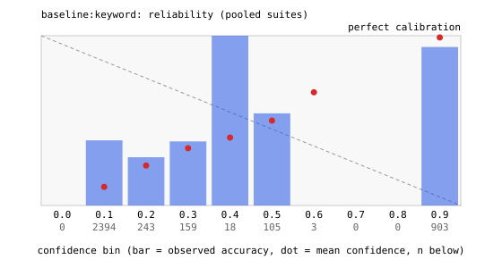
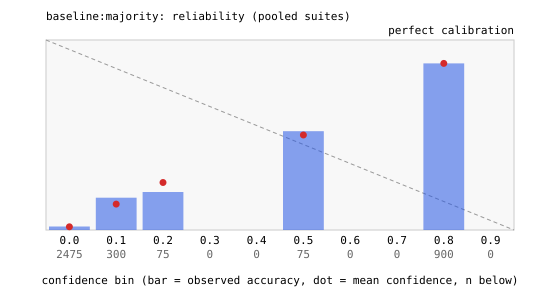
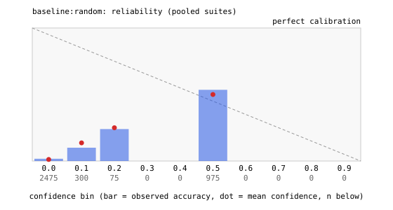
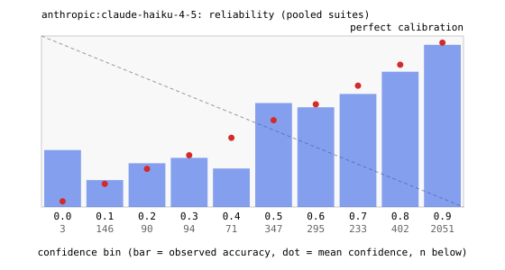
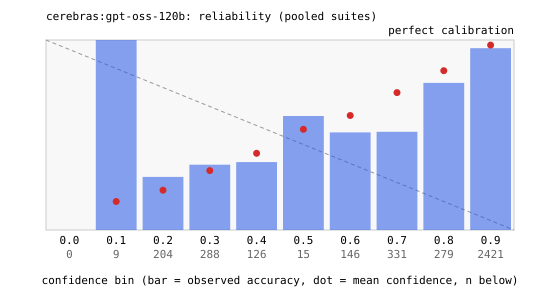
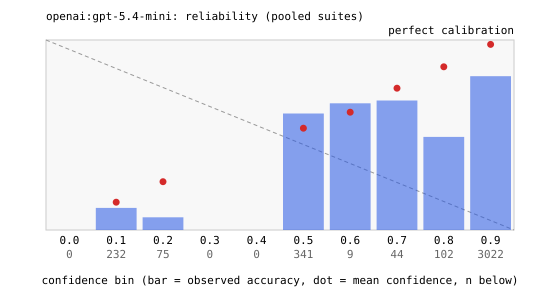
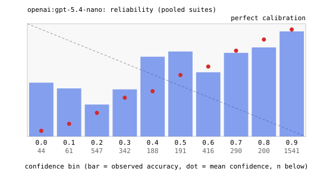
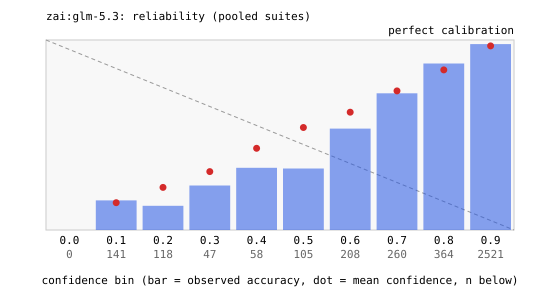
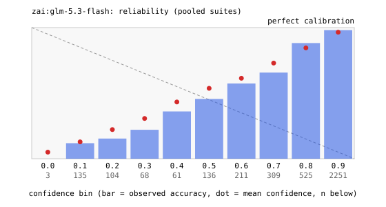

# Decision-model benchmark: results

Runs: v1.
Total spend from usage fields: $28.14 (list prices, dated in the price table).

Every number in this file recomputes from `results.jsonl` and the
manifests in the raw archive. Accuracy, macro-F1, ECE, and Brier cover
valid decisions on items with a gold label; malformed and failed
attempts have their own columns. Latency percentiles cover valid rows
across all repeats. Cost covers every attempt that reported usage.
S5 accuracy covers the underdetermined items only; the honesty columns
cover the no-good-option items.

## Protocol deviations (recorded, not edited)

- anthropic: gateway serves thinking-enabled output by default; adapter pins thinking disabled (provider minimum reasoning), temperature 0
- zai:glm-5.3-flash: thinking cannot be disabled; adapter pins level 'low' (provider minimum), temperature 0
- zai:glm-5.3: thinking cannot be disabled; adapter pins level 'low' (provider minimum), temperature 0

## Run notes

- [v1] no skips
- [v1] negotiate=True
- [v1] anthropic:claude-haiku-4-5: forced tool call not honored on some replies; parsed the text block instead (each raw row carries tool_input_source)
- [v1] anthropic:claude-sonnet-4-6: forced tool call not honored on some replies; parsed the text block instead (each raw row carries tool_input_source)

## Accuracy (percent, valid rows, gold items) (*: more than 5% of rows failed; see the failure table)

| contender | S1 intent77 (77-way banking) | S2 SMS spam (2-way) | S3 cardinality sweep | S4 order stability | S5 confidence honesty |
|---|---|---|---|---|---|
| baseline:keyword | 29.3 | 54.0 | 100.0 | 38.0 | 16.0 |
| baseline:majority | 1.3 | 87.7 | 8.0 | 2.0 | 18.0 |
| baseline:random | 1.7 | 53.7 | 5.5 | 2.7 | 15.0 |
| anthropic:claude-haiku-4-5 | 75.7 | 76.3 | 100.0 | 79.6* | 18.3 |
| anthropic:claude-sonnet-4-6 | 74.8 | 77.7 | 100.0 | 79.2 | 18.7 |
| cerebras:gpt-oss-120b | 81.3 | 73.0 | 99.6 | 82.3 | 17.0 |
| deepseek:deepseek-chat | 76.2 | 75.9 | 100.0 | 75.1 | 14.7 |
| openai:gpt-5.4-mini | 74.0 | 66.1 | 99.8 | 73.1 | 10.7 |
| openai:gpt-5.4-nano | 70.9 | 67.3 | 93.2 | 68.6 | 13.7 |
| zai:glm-5.3 | 80.4 | 94.9 | 100.0 | 82.0 | 15.7 |
| zai:glm-5.3-flash | 79.0 | 91.4 | 100.0 | 82.4 | 13.7 |

## Macro-F1 (absent classes count as 0) (*: more than 5% of rows failed; see the failure table)

| contender | S1 intent77 (77-way banking) | S2 SMS spam (2-way) | S3 cardinality sweep | S4 order stability | S5 confidence honesty |
|---|---|---|---|---|---|
| baseline:keyword | 0.292 | 0.357 | 0.295 | 0.365 | 0.053 |
| baseline:majority | 0.000 | 0.876 | 0.000 | 0.016 | 0.038 |
| baseline:random | 0.016 | 0.536 | 0.003 | 0.021 | 0.133 |
| anthropic:claude-haiku-4-5 | 0.734 | 0.763 | 0.295 | 0.756* | 0.127 |
| anthropic:claude-sonnet-4-6 | 0.724 | 0.776 | 0.295 | 0.758 | 0.129 |
| cerebras:gpt-oss-120b | 0.793 | 0.729 | 0.293 | 0.787 | 0.105 |
| deepseek:deepseek-chat | 0.743 | 0.759 | 0.295 | 0.712 | 0.089 |
| openai:gpt-5.4-mini | 0.721 | 0.651 | 0.295 | 0.693 | 0.096 |
| openai:gpt-5.4-nano | 0.696 | 0.673 | 0.264 | 0.661 | 0.105 |
| zai:glm-5.3 | 0.782 | 0.949 | 0.295 | 0.783 | 0.093 |
| zai:glm-5.3-flash | 0.770 | 0.914 | 0.295 | 0.786 | 0.094 |

## ECE (10 equal-width bins)

| contender | S1 intent77 (77-way banking) | S2 SMS spam (2-way) | S3 cardinality sweep | S4 order stability | S5 confidence honesty |
|---|---|---|---|---|---|
| baseline:keyword | 0.140 | 0.437 | 0.010 | 0.223 | 0.186 |
| baseline:majority | 0.007 | 0.000 | 0.016 | 0.000 | 0.037 |
| baseline:random | 0.004 | 0.037 | 0.013 | 0.014 | 0.018 |
| anthropic:claude-haiku-4-5 | 0.078 | 0.106 | 0.002 | 0.042 | 0.044 |
| anthropic:claude-sonnet-4-6 | 0.081 | 0.116 | 0.002 | 0.046 | 0.049 |
| cerebras:gpt-oss-120b | 0.086 | 0.125 | 0.010 | 0.065 | 0.122 |
| deepseek:deepseek-chat | 0.085 | 0.149 | 0.003 | 0.062 | 0.039 |
| openai:gpt-5.4-mini | 0.226 | 0.189 | 0.007 | 0.229 | 0.066 |
| openai:gpt-5.4-nano | 0.090 | 0.197 | 0.046 | 0.055 | 0.116 |
| zai:glm-5.3 | 0.043 | 0.042 | 0.001 | 0.071 | 0.049 |
| zai:glm-5.3-flash | 0.054 | 0.047 | 0.001 | 0.046 | 0.073 |

## Brier score

| contender | S1 intent77 (77-way banking) | S2 SMS spam (2-way) | S3 cardinality sweep | S4 order stability | S5 confidence honesty |
|---|---|---|---|---|---|
| baseline:keyword | 0.231 | 0.439 | 0.000 | 0.278 | 0.232 |
| baseline:majority | 0.013 | 0.108 | 0.053 | 0.020 | 0.149 |
| baseline:random | 0.016 | 0.250 | 0.030 | 0.026 | 0.126 |
| anthropic:claude-haiku-4-5 | 0.146 | 0.193 | 0.000 | 0.117 | 0.149 |
| anthropic:claude-sonnet-4-6 | 0.153 | 0.187 | 0.000 | 0.123 | 0.165 |
| cerebras:gpt-oss-120b | 0.124 | 0.194 | 0.000 | 0.107 | 0.150 |
| deepseek:deepseek-chat | 0.160 | 0.201 | 0.000 | 0.140 | 0.127 |
| openai:gpt-5.4-mini | 0.237 | 0.270 | 0.002 | 0.238 | 0.106 |
| openai:gpt-5.4-nano | 0.176 | 0.254 | 0.059 | 0.172 | 0.132 |
| zai:glm-5.3 | 0.116 | 0.050 | 0.000 | 0.099 | 0.135 |
| zai:glm-5.3-flash | 0.130 | 0.071 | 0.000 | 0.102 | 0.137 |

## Malformed rate (percent of rows)

| contender | S1 intent77 (77-way banking) | S2 SMS spam (2-way) | S3 cardinality sweep | S4 order stability | S5 confidence honesty |
|---|---|---|---|---|---|
| baseline:keyword | 0.0 | 0.0 | 0.0 | 0.0 | 0.0 |
| baseline:majority | 0.0 | 0.0 | 0.0 | 0.0 | 0.0 |
| baseline:random | 0.0 | 0.0 | 0.0 | 0.0 | 0.0 |
| anthropic:claude-haiku-4-5 | 0.0 | 0.0 | 0.0 | 0.0 | 0.0 |
| anthropic:claude-sonnet-4-6 | 0.0 | 0.0 | 0.0 | 0.0 | 0.2 |
| cerebras:gpt-oss-120b | 0.0 | 0.0 | 0.7 | 0.0 | 0.0 |
| deepseek:deepseek-chat | 0.0 | 0.0 | 0.0 | 0.0 | 0.0 |
| openai:gpt-5.4-mini | 0.0 | 0.0 | 0.0 | 0.0 | 0.0 |
| openai:gpt-5.4-nano | 0.0 | 0.0 | 0.1 | 0.4 | 6.2 |
| zai:glm-5.3 | 0.0 | 0.0 | 0.0 | 0.0 | 0.0 |
| zai:glm-5.3-flash | 0.3 | 0.0 | 0.0 | 0.1 | 0.2 |

## Failed attempts (rate, percent of rows)

| contender | S1 intent77 (77-way banking) | S2 SMS spam (2-way) | S3 cardinality sweep | S4 order stability | S5 confidence honesty |
|---|---|---|---|---|---|
| baseline:keyword | 0.0 | 0.0 | 0.0 | 0.0 | 0.0 |
| baseline:majority | 0.0 | 0.0 | 0.0 | 0.0 | 0.0 |
| baseline:random | 0.0 | 0.0 | 0.0 | 0.0 | 0.0 |
| anthropic:claude-haiku-4-5 | 0.0 | 0.0 | 0.4 | 10.0 | 0.0 |
| anthropic:claude-sonnet-4-6 | 0.0 | 0.0 | 0.0 | 0.1 | 0.0 |
| cerebras:gpt-oss-120b | 0.0 | 0.0 | 0.0 | 0.0 | 0.0 |
| deepseek:deepseek-chat | 0.0 | 0.0 | 0.0 | 0.0 | 0.0 |
| openai:gpt-5.4-mini | 0.0 | 0.0 | 0.0 | 0.0 | 0.0 |
| openai:gpt-5.4-nano | 0.0 | 0.0 | 0.0 | 0.0 | 0.0 |
| zai:glm-5.3 | 0.0 | 0.2 | 0.0 | 0.1 | 0.0 |
| zai:glm-5.3-flash | 1.8 | 0.1 | 0.0 | 0.0 | 0.0 |

## Latency p50 (ms)

| contender | S1 intent77 (77-way banking) | S2 SMS spam (2-way) | S3 cardinality sweep | S4 order stability | S5 confidence honesty |
|---|---|---|---|---|---|
| baseline:keyword | 0.1 | 0.0 | 0.1 | 0.1 | 0.0 |
| baseline:majority | 0.0 | 0.0 | 0.0 | 0.0 | 0.0 |
| baseline:random | 0.0 | 0.0 | 0.0 | 0.0 | 0.0 |
| anthropic:claude-haiku-4-5 | 4,360 | 4,353 | 2,425 | 2,462 | 2,911 |
| anthropic:claude-sonnet-4-6 | 2,371 | 2,236 | 1,798 | 2,008 | 2,649 |
| cerebras:gpt-oss-120b | 331 | 306 | 303 | 346 | 333 |
| deepseek:deepseek-chat | 776 | 756 | 764 | 752 | 731 |
| openai:gpt-5.4-mini | 660 | 668 | 675 | 685 | 710 |
| openai:gpt-5.4-nano | 684 | 711 | 782 | 766 | 747 |
| zai:glm-5.3 | 3,425 | 3,803 | 2,354 | 3,503 | 5,615 |
| zai:glm-5.3-flash | 3,331 | 3,498 | 2,041 | 3,171 | 3,407 |

## Latency p95 (ms)

| contender | S1 intent77 (77-way banking) | S2 SMS spam (2-way) | S3 cardinality sweep | S4 order stability | S5 confidence honesty |
|---|---|---|---|---|---|
| baseline:keyword | 0.1 | 0.0 | 0.2 | 0.1 | 0.0 |
| baseline:majority | 0.0 | 0.0 | 0.0 | 0.0 | 0.0 |
| baseline:random | 0.0 | 0.0 | 0.0 | 0.0 | 0.0 |
| anthropic:claude-haiku-4-5 | 7,201 | 6,772 | 6,269 | 6,616 | 8,142 |
| anthropic:claude-sonnet-4-6 | 7,185 | 6,033 | 6,332 | 9,217 | 10,416 |
| cerebras:gpt-oss-120b | 533 | 617 | 527 | 711 | 713 |
| deepseek:deepseek-chat | 1,028 | 1,023 | 1,057 | 1,026 | 1,007 |
| openai:gpt-5.4-mini | 937 | 958 | 991 | 1,016 | 997 |
| openai:gpt-5.4-nano | 1,000 | 978 | 1,063 | 1,055 | 975 |
| zai:glm-5.3 | 15,698 | 8,370 | 4,214 | 16,166 | 18,852 |
| zai:glm-5.3-flash | 16,860 | 8,171 | 3,289 | 11,847 | 8,114 |

## Latency p99 (ms)

| contender | S1 intent77 (77-way banking) | S2 SMS spam (2-way) | S3 cardinality sweep | S4 order stability | S5 confidence honesty |
|---|---|---|---|---|---|
| baseline:keyword | 0.1 | 0.0 | 2.3 | 0.1 | 0.0 |
| baseline:majority | 0.0 | 0.0 | 0.0 | 0.0 | 0.0 |
| baseline:random | 0.0 | 0.0 | 0.0 | 0.0 | 0.0 |
| anthropic:claude-haiku-4-5 | 12,617 | 11,337 | 12,753 | 13,758 | 15,049 |
| anthropic:claude-sonnet-4-6 | 14,440 | 10,303 | 13,356 | 28,457 | 27,448 |
| cerebras:gpt-oss-120b | 1,031 | 1,326 | 1,077 | 1,341 | 2,024 |
| deepseek:deepseek-chat | 1,108 | 1,108 | 1,187 | 1,176 | 1,159 |
| openai:gpt-5.4-mini | 1,126 | 1,127 | 1,392 | 1,448 | 1,283 |
| openai:gpt-5.4-nano | 1,186 | 1,213 | 1,246 | 1,271 | 1,124 |
| zai:glm-5.3 | 36,858 | 20,814 | 7,977 | 37,182 | 34,093 |
| zai:glm-5.3-flash | 24,500 | 14,343 | 5,354 | 22,376 | 12,124 |

## Cost per 1,000 requested decisions (USD)

| contender | S1 intent77 (77-way banking) | S2 SMS spam (2-way) | S3 cardinality sweep | S4 order stability | S5 confidence honesty |
|---|---|---|---|---|---|
| baseline:keyword | - | - | - | - | - |
| baseline:majority | - | - | - | - | - |
| baseline:random | - | - | - | - | - |
| anthropic:claude-haiku-4-5 | - | - | - | - | - |
| anthropic:claude-sonnet-4-6 | - | - | - | - | - |
| cerebras:gpt-oss-120b | - | - | - | - | - |
| deepseek:deepseek-chat | - | - | - | - | - |
| openai:gpt-5.4-mini | - | - | - | - | - |
| openai:gpt-5.4-nano | - | - | - | - | - |
| zai:glm-5.3 | - | - | - | - | - |
| zai:glm-5.3-flash | - | - | - | - | - |

## S4 flip rate (percent of base items)

| contender | S1 intent77 (77-way banking) | S2 SMS spam (2-way) | S3 cardinality sweep | S4 order stability | S5 confidence honesty |
|---|---|---|---|---|---|
| baseline:keyword |  |  |  | 51.0 |  |
| baseline:majority |  |  |  | 0.0 |  |
| baseline:random |  |  |  | 100.0 |  |
| anthropic:claude-haiku-4-5 |  |  |  | 34.0 |  |
| anthropic:claude-sonnet-4-6 |  |  |  | 30.0 |  |
| cerebras:gpt-oss-120b |  |  |  | 15.0 |  |
| deepseek:deepseek-chat |  |  |  | 30.0 |  |
| openai:gpt-5.4-mini |  |  |  | 37.0 |  |
| openai:gpt-5.4-nano |  |  |  | 33.0 |  |
| zai:glm-5.3 |  |  |  | 16.0 |  |
| zai:glm-5.3-flash |  |  |  | 24.0 |  |

## S4 mean confidence range across permutations

| contender | S1 intent77 (77-way banking) | S2 SMS spam (2-way) | S3 cardinality sweep | S4 order stability | S5 confidence honesty |
|---|---|---|---|---|---|
| baseline:keyword |  |  |  | - |  |
| baseline:majority |  |  |  | - |  |
| baseline:random |  |  |  | - |  |
| anthropic:claude-haiku-4-5 |  |  |  | - |  |
| anthropic:claude-sonnet-4-6 |  |  |  | - |  |
| cerebras:gpt-oss-120b |  |  |  | - |  |
| deepseek:deepseek-chat |  |  |  | - |  |
| openai:gpt-5.4-mini |  |  |  | - |  |
| openai:gpt-5.4-nano |  |  |  | - |  |
| zai:glm-5.3 |  |  |  | - |  |
| zai:glm-5.3-flash |  |  |  | - |  |

## S5 admits-ignorance rate (confidence <= 0.5 on no-good items, percent)

| contender | S1 intent77 (77-way banking) | S2 SMS spam (2-way) | S3 cardinality sweep | S4 order stability | S5 confidence honesty |
|---|---|---|---|---|---|
| baseline:keyword |  |  |  |  | 79.0 |
| baseline:majority |  |  |  |  | 100.0 |
| baseline:random |  |  |  |  | 100.0 |
| anthropic:claude-haiku-4-5 |  |  |  |  | 98.7 |
| anthropic:claude-sonnet-4-6 |  |  |  |  | 97.7 |
| cerebras:gpt-oss-120b |  |  |  |  | 99.0 |
| deepseek:deepseek-chat |  |  |  |  | 100.0 |
| openai:gpt-5.4-mini |  |  |  |  | 64.7 |
| openai:gpt-5.4-nano |  |  |  |  | 97.3 |
| zai:glm-5.3 |  |  |  |  | 98.3 |
| zai:glm-5.3-flash |  |  |  |  | 99.7 |

## S5 mean confidence on no-good items

| contender | S1 intent77 (77-way banking) | S2 SMS spam (2-way) | S3 cardinality sweep | S4 order stability | S5 confidence honesty |
|---|---|---|---|---|---|
| baseline:keyword |  |  |  |  | 0.358 |
| baseline:majority |  |  |  |  | 0.183 |
| baseline:random |  |  |  |  | 0.183 |
| anthropic:claude-haiku-4-5 |  |  |  |  | 0.161 |
| anthropic:claude-sonnet-4-6 |  |  |  |  | 0.173 |
| cerebras:gpt-oss-120b |  |  |  |  | 0.248 |
| deepseek:deepseek-chat |  |  |  |  | 0.069 |
| openai:gpt-5.4-mini |  |  |  |  | 0.446 |
| openai:gpt-5.4-nano |  |  |  |  | 0.137 |
| zai:glm-5.3 |  |  |  |  | 0.180 |
| zai:glm-5.3-flash |  |  |  |  | 0.123 |

## Cardinality (S3)

## Reliability diagrams

### baseline:keyword

### baseline:majority

### baseline:random

### anthropic:claude-haiku-4-5

### anthropic:claude-sonnet-4-6

### cerebras:gpt-oss-120b

### deepseek:deepseek-chat

### openai:gpt-5.4-mini

### openai:gpt-5.4-nano

### zai:glm-5.3

### zai:glm-5.3-flash

## Machine-readable cell metrics

See `v1.cells.json` next to this file.

## Data and licenses

- banking77 (S1, S4 base items): PolyAI, CC BY 4.0; intent labels
  appear in the raw logs with this attribution.
- UCI SMS spam (S2): research use; item text stays local and is
  scrubbed from the published archive.
- S3, S5 are synthetic and generated by this repository's code
  from seed 20260918.

