# Decision-model benchmark: results

Runs: v1, v1.1, v2-majority-fix.
Total spend from usage fields: $28.34 (list prices, dated in the price table; spend of the selected cells: $28.34).

Every number in this file recomputes from `results.jsonl` and the
manifests in the raw archive. Later runs replace earlier cells
whole; each coverage row names its source run.

Denominators:

- Accuracy, macro-F1, ECE, and Brier cover valid decisions on
  items with a gold label.
- Completion coverage is completed decisions divided by expected
  decisions; valid coverage is valid decisions divided by expected
  decisions.
- Malformed and failed rates use completed decisions as the
  denominator.
- Cost covers the attempt charges each cell's `cost_scope` names;
  unknown usage is never treated as a measured zero.
- Latency scopes are mixed across source runs; see each cell's source run and protocol version.

## Correction note

## Corrections in v2

This report supersedes `v1.md` and `v1.1.md`. The original files stay
unchanged in this repository; the raw run directories are untouched. This
note maps each corrected number to the defect that produced the old one.

### What changed

| Metric | v1 (old) | v2 (corrected) | Defect |
|---|---|---|---|
| Majority baseline, S4 accuracy | 2.0% | 1.0% | The S4 order suite silently used its own frozen prior (`topping_up_by_card`, 6/300) instead of the S1 prior the protocol pins. The prior table let the last-loaded suite overwrite an option set shared by S1 and S4. |
| Majority baseline, S4 macro-F1 | 0.000509 | 0.000257 | Same prior defect, scored with the corrected prior and stable option-text labels. |
| Majority baseline, S4 confidence | 0.02 | 0.013333 | The recorded prior itself was wrong; the baseline reports the prior as its confidence. |
| Macro-F1 on S1, S2, S4 (all contenders) | positions as classes | option texts as classes | v1 macro-F1 averaged F1 over option positions. On S4 the options are permuted per item, so positions are not classes and the score was meaningless there. v2 uses stable option-text labels; the v1 numbers on S1 and S2 stay comparable because their option lists are fixed. |
| Macro-F1 on S3, S5 | numeric | n/a | S3 code words and S5 alternatives vary between items, so macro-F1 does not apply. v1 printed position-based numbers there anyway. |
| S2 majority macro-F1 | not published | 0.467140 | The majority baseline answers `ham` on every S2 item (prior 0.877). With the absent `spam` class scoring 0, macro-F1 is 0.467140. This is the corrected definition, not a run change. |
| Baseline cost | unknown (`-`) | $0.00 measured | v1 rows carried no usage for baselines, so cost rendered as unknown. Deterministic baselines make no billable calls; v2 records a measured zero. |
| LLM cost where retries happened | full number | marked `†` lower bound | v1 rows kept only the final attempt's usage, so retried decisions undercounted cost. v2 runs record every attempt; for v1 cells the report now marks the number as a lower bound instead of presenting it as exact. |
| Latency | per request | per decision (v2 cells) | v1 latency covered one request. Protocol v2 covers the whole decision, including retry backoff. The scope is stated per cell; v1 cells keep the request scope. |

### Where the corrected S4 cells come from

Run `v2-majority-fix` (protocol v2, included in this report's raw archive):
the majority baseline over S1 and S4 with the pinned S1 prior
(`apple_pay_or_google_pay`, 4/300 = 0.013333, source hash in the run
manifest). It replaces the v1 `baseline:majority` cells for S1 and S4
whole. Every other cell still comes from runs `v1` and `v1.1`; the
coverage table names the source run for each cell.

The v1 majority cells for S1 were also wrong in v1 (the same collision
gave S1 the S4 prior). The corrected S1 accuracy rounds to the same 1.3%
because the corrected prior option is almost never the gold answer
either; the confidence column changes from 0.02 to 0.013333, which is the
visible difference.

### Protocol versions merged

Runs `v1` and `v1.1` predate protocol v2; run `v2-majority-fix` records
protocol v2. They are merged here by explicit policy
(`--allow-protocol-mix`). The mix affects only the replaced
`baseline:majority` cells: their latency scope is the whole decision
rather than one request, and their usage is a measured zero rather than
unknown. No LLM cell was re-run.

### What was not fixed retroactively

The v1 measurement gaps stay gaps: per-attempt usage and retry latency
for v1 cells were never recorded, so v2 reports them as unknown or
lower-bound values instead of estimating them. Recoverable numbers
(accuracy, macro-F1, coverage, calibration) were recomputed from the
existing rows; missing measurements were not invented.

## Protocol and data caveats

- Mixed protocol versions merged by explicit policy: v1. Replacement cells from different versions may differ in latency scope, prompt text, and record format; the per-cell source run column says which version each cell came from.
- Cost caveats: some cells report incomplete usage. Unknown usage is not a measured zero; see the cost table markers and the coverage table.

## Protocol deviations (recorded, not edited)

- anthropic: gateway serves thinking-enabled output by default; adapter pins thinking disabled (provider minimum reasoning), temperature 0
- zai:glm-5.3-flash: thinking cannot be disabled; adapter pins level 'low' (provider minimum), temperature 0
- zai:glm-5.3: thinking cannot be disabled; adapter pins level 'low' (provider minimum), temperature 0

## Run notes

- [v1] no skips
- [v1] negotiate=True
- [v1] anthropic:claude-haiku-4-5: forced tool call not honored on some replies; parsed the text block instead (each raw row carries tool_input_source)
- [v1] anthropic:claude-sonnet-4-6: forced tool call not honored on some replies; parsed the text block instead (each raw row carries tool_input_source)
- [v1.1] no skips
- [v1.1] negotiate=True
- [v2-majority-fix] no skips
- [v2-majority-fix] negotiate=False
- [v2-majority-fix] contender filter: ['baseline:majority']

## Coverage (expected versus completed decisions)

| contender | suite | status | expected | completed | valid | malformed | failed | completion % | valid % | stop reason | source run |
|---|---|---|---|---|---|---|---|---|---|---|---|
| baseline:keyword | S1 intent77 (77-way banking) | ok | 900 | 900 | 900 | 0 | 0 | 100.0 | 100.0 |  | v1 |
| baseline:keyword | S2 SMS spam (2-way) | ok | 900 | 900 | 900 | 0 | 0 | 100.0 | 100.0 |  | v1 |
| baseline:keyword | S3 cardinality sweep | ok | 825 | 825 | 825 | 0 | 0 | 100.0 | 100.0 |  | v1 |
| baseline:keyword | S4 order stability | ok | 900 | 900 | 900 | 0 | 0 | 100.0 | 100.0 |  | v1 |
| baseline:keyword | S5 confidence honesty | ok | 600 | 600 | 600 | 0 | 0 | 100.0 | 100.0 |  | v1 |
| baseline:majority | S1 intent77 (77-way banking) | ok | 900 | 900 | 900 | 0 | 0 | 100.0 | 100.0 |  | v2-majority-fix |
| baseline:majority | S2 SMS spam (2-way) | ok | 900 | 900 | 900 | 0 | 0 | 100.0 | 100.0 |  | v1 |
| baseline:majority | S3 cardinality sweep | ok | 825 | 825 | 825 | 0 | 0 | 100.0 | 100.0 |  | v1 |
| baseline:majority | S4 order stability | ok | 900 | 900 | 900 | 0 | 0 | 100.0 | 100.0 |  | v2-majority-fix |
| baseline:majority | S5 confidence honesty | ok | 600 | 600 | 600 | 0 | 0 | 100.0 | 100.0 |  | v1 |
| baseline:random | S1 intent77 (77-way banking) | ok | 900 | 900 | 900 | 0 | 0 | 100.0 | 100.0 |  | v1 |
| baseline:random | S2 SMS spam (2-way) | ok | 900 | 900 | 900 | 0 | 0 | 100.0 | 100.0 |  | v1 |
| baseline:random | S3 cardinality sweep | ok | 825 | 825 | 825 | 0 | 0 | 100.0 | 100.0 |  | v1 |
| baseline:random | S4 order stability | ok | 900 | 900 | 900 | 0 | 0 | 100.0 | 100.0 |  | v1 |
| baseline:random | S5 confidence honesty | ok | 600 | 600 | 600 | 0 | 0 | 100.0 | 100.0 |  | v1 |
| anthropic:claude-haiku-4-5 | S1 intent77 (77-way banking) | ok | 900 | 900 | 900 | 0 | 0 | 100.0 | 100.0 |  | v1 |
| anthropic:claude-haiku-4-5 | S2 SMS spam (2-way) | ok | 900 | 900 | 900 | 0 | 0 | 100.0 | 100.0 |  | v1 |
| anthropic:claude-haiku-4-5 | S3 cardinality sweep | ok | 825 | 825 | 822 | 0 | 3 | 100.0 | 99.6 |  | v1 |
| anthropic:claude-haiku-4-5 | S4 order stability | ok | 900 | 900 | 810 | 0 | 90 | 100.0 | 90.0 |  | v1 |
| anthropic:claude-haiku-4-5 | S5 confidence honesty | ok | 600 | 600 | 600 | 0 | 0 | 100.0 | 100.0 |  | v1 |
| anthropic:claude-sonnet-4-6 | S1 intent77 (77-way banking) | ok | 900 | 900 | 900 | 0 | 0 | 100.0 | 100.0 |  | v1 |
| anthropic:claude-sonnet-4-6 | S2 SMS spam (2-way) | ok | 900 | 900 | 900 | 0 | 0 | 100.0 | 100.0 |  | v1 |
| anthropic:claude-sonnet-4-6 | S3 cardinality sweep | ok | 825 | 825 | 825 | 0 | 0 | 100.0 | 100.0 |  | v1 |
| anthropic:claude-sonnet-4-6 | S4 order stability | ok | 900 | 900 | 899 | 0 | 1 | 100.0 | 99.9 |  | v1 |
| anthropic:claude-sonnet-4-6 | S5 confidence honesty | ok | 600 | 600 | 599 | 1 | 0 | 100.0 | 99.8 |  | v1 |
| cerebras:gpt-oss-120b | S1 intent77 (77-way banking) | ok | 900 | 900 | 900 | 0 | 0 | 100.0 | 100.0 |  | v1 |
| cerebras:gpt-oss-120b | S2 SMS spam (2-way) | ok | 900 | 900 | 900 | 0 | 0 | 100.0 | 100.0 |  | v1 |
| cerebras:gpt-oss-120b | S3 cardinality sweep | ok | 825 | 825 | 819 | 6 | 0 | 100.0 | 99.3 |  | v1 |
| cerebras:gpt-oss-120b | S4 order stability | ok | 900 | 900 | 900 | 0 | 0 | 100.0 | 100.0 |  | v1 |
| cerebras:gpt-oss-120b | S5 confidence honesty | ok | 600 | 600 | 600 | 0 | 0 | 100.0 | 100.0 |  | v1 |
| deepseek:deepseek-chat | S1 intent77 (77-way banking) | ok | 900 | 900 | 900 | 0 | 0 | 100.0 | 100.0 |  | v1 |
| deepseek:deepseek-chat | S2 SMS spam (2-way) | ok | 900 | 900 | 900 | 0 | 0 | 100.0 | 100.0 |  | v1 |
| deepseek:deepseek-chat | S3 cardinality sweep | ok | 825 | 825 | 825 | 0 | 0 | 100.0 | 100.0 |  | v1 |
| deepseek:deepseek-chat | S4 order stability | ok | 900 | 900 | 900 | 0 | 0 | 100.0 | 100.0 |  | v1 |
| deepseek:deepseek-chat | S5 confidence honesty | ok | 600 | 600 | 600 | 0 | 0 | 100.0 | 100.0 |  | v1 |
| openai:gpt-5.4-mini | S1 intent77 (77-way banking) | ok | 900 | 900 | 900 | 0 | 0 | 100.0 | 100.0 |  | v1 |
| openai:gpt-5.4-mini | S2 SMS spam (2-way) | ok | 900 | 900 | 900 | 0 | 0 | 100.0 | 100.0 |  | v1 |
| openai:gpt-5.4-mini | S3 cardinality sweep | ok | 825 | 825 | 825 | 0 | 0 | 100.0 | 100.0 |  | v1 |
| openai:gpt-5.4-mini | S4 order stability | ok | 900 | 900 | 900 | 0 | 0 | 100.0 | 100.0 |  | v1 |
| openai:gpt-5.4-mini | S5 confidence honesty | ok | 600 | 600 | 600 | 0 | 0 | 100.0 | 100.0 |  | v1 |
| openai:gpt-5.4-nano | S1 intent77 (77-way banking) | ok | 900 | 900 | 900 | 0 | 0 | 100.0 | 100.0 |  | v1 |
| openai:gpt-5.4-nano | S2 SMS spam (2-way) | ok | 900 | 900 | 900 | 0 | 0 | 100.0 | 100.0 |  | v1 |
| openai:gpt-5.4-nano | S3 cardinality sweep | ok | 825 | 825 | 824 | 1 | 0 | 100.0 | 99.9 |  | v1 |
| openai:gpt-5.4-nano | S4 order stability | ok | 900 | 900 | 896 | 4 | 0 | 100.0 | 99.6 |  | v1 |
| openai:gpt-5.4-nano | S5 confidence honesty | ok | 600 | 600 | 563 | 37 | 0 | 100.0 | 93.8 |  | v1 |
| typesafe:jev | S1 intent77 (77-way banking) | ok | 900 | 900 | 900 | 0 | 0 | 100.0 | 100.0 |  | v1.1 |
| typesafe:jev | S2 SMS spam (2-way) | ok | 900 | 900 | 900 | 0 | 0 | 100.0 | 100.0 |  | v1.1 |
| typesafe:jev | S3 cardinality sweep | ok | 825 | 825 | 600 | 0 | 225 | 100.0 | 72.7 |  | v1.1 |
| typesafe:jev | S4 order stability | ok | 900 | 900 | 900 | 0 | 0 | 100.0 | 100.0 |  | v1.1 |
| typesafe:jev | S5 confidence honesty | ok | 600 | 600 | 600 | 0 | 0 | 100.0 | 100.0 |  | v1.1 |
| zai:glm-5.3 | S1 intent77 (77-way banking) | ok | 900 | 900 | 900 | 0 | 0 | 100.0 | 100.0 |  | v1 |
| zai:glm-5.3 | S2 SMS spam (2-way) | ok | 900 | 900 | 898 | 0 | 2 | 100.0 | 99.8 |  | v1 |
| zai:glm-5.3 | S3 cardinality sweep | ok | 825 | 825 | 825 | 0 | 0 | 100.0 | 100.0 |  | v1 |
| zai:glm-5.3 | S4 order stability | ok | 900 | 900 | 899 | 0 | 1 | 100.0 | 99.9 |  | v1 |
| zai:glm-5.3 | S5 confidence honesty | ok | 600 | 600 | 600 | 0 | 0 | 100.0 | 100.0 |  | v1 |
| zai:glm-5.3-flash | S1 intent77 (77-way banking) | ok | 900 | 900 | 881 | 3 | 16 | 100.0 | 97.9 |  | v1 |
| zai:glm-5.3-flash | S2 SMS spam (2-way) | ok | 900 | 900 | 899 | 0 | 1 | 100.0 | 99.9 |  | v1 |
| zai:glm-5.3-flash | S3 cardinality sweep | ok | 825 | 825 | 825 | 0 | 0 | 100.0 | 100.0 |  | v1 |
| zai:glm-5.3-flash | S4 order stability | ok | 900 | 900 | 899 | 1 | 0 | 100.0 | 99.9 |  | v1 |
| zai:glm-5.3-flash | S5 confidence honesty | ok | 600 | 600 | 599 | 1 | 0 | 100.0 | 99.8 |  | v1 |

A cell is partial when it stopped early or returned malformed or
failed decisions. Empty, failed, and skipped cells stay listed
with their reasons.

## Accuracy (percent, valid rows, gold items) (*: partial coverage; see the coverage table)

| contender | S1 intent77 (77-way banking) | S2 SMS spam (2-way) | S3 cardinality sweep | S4 order stability | S5 confidence honesty |
|---|---|---|---|---|---|
| baseline:keyword | 29.3 | 54.0 | 100.0 | 38.0 | 16.0 |
| baseline:majority | 1.3 | 87.7 | 8.0 | 1.0 | 18.0 |
| baseline:random | 1.7 | 53.7 | 5.5 | 2.7 | 15.0 |
| anthropic:claude-haiku-4-5 | 75.7 | 76.3 | 100.0* | 79.6* | 18.3 |
| anthropic:claude-sonnet-4-6 | 74.8 | 77.7 | 100.0 | 79.2* | 18.7* |
| cerebras:gpt-oss-120b | 81.3 | 73.0 | 99.6* | 82.3 | 17.0 |
| deepseek:deepseek-chat | 76.2 | 75.9 | 100.0 | 75.1 | 14.7 |
| openai:gpt-5.4-mini | 74.0 | 66.1 | 99.8 | 73.1 | 10.7 |
| openai:gpt-5.4-nano | 70.9 | 67.3 | 93.2* | 68.6* | 13.7* |
| typesafe:jev | 76.3 | 93.0 | 100.0* | 76.7 | 14.3 |
| zai:glm-5.3 | 80.4 | 94.9* | 100.0 | 82.0* | 15.7 |
| zai:glm-5.3-flash | 79.0* | 91.4* | 100.0 | 82.4* | 13.7* |

## Macro-F1 (stable option labels; absent classes count as 0) (*: partial coverage; see the coverage table). Not applicable on S3 and S5: their option texts vary between items, so positions are not classes

| contender | S1 intent77 (77-way banking) | S2 SMS spam (2-way) | S3 cardinality sweep | S4 order stability | S5 confidence honesty |
|---|---|---|---|---|---|
| baseline:keyword | 0.292 | 0.459 | n/a | 0.337 | n/a |
| baseline:majority | 0.000 | 0.467 | n/a | 0.000 | n/a |
| baseline:random | 0.016 | 0.428 | n/a | 0.027 | n/a |
| anthropic:claude-haiku-4-5 | 0.734 | 0.672 | n/a | 0.754* | n/a |
| anthropic:claude-sonnet-4-6 | 0.724 | 0.686 | n/a | 0.747* | n/a |
| cerebras:gpt-oss-120b | 0.793 | 0.642 | n/a | 0.783 | n/a |
| deepseek:deepseek-chat | 0.743 | 0.661 | n/a | 0.708 | n/a |
| openai:gpt-5.4-mini | 0.721 | 0.585 | n/a | 0.696 | n/a |
| openai:gpt-5.4-nano | 0.696 | 0.593 | n/a | 0.632* | n/a |
| typesafe:jev | 0.742 | 0.864 | n/a | 0.716 | n/a |
| zai:glm-5.3 | 0.782 | 0.895* | n/a | 0.779* | n/a |
| zai:glm-5.3-flash | 0.770* | 0.840* | n/a | 0.784* | n/a |

## ECE (10 equal-width bins)

| contender | S1 intent77 (77-way banking) | S2 SMS spam (2-way) | S3 cardinality sweep | S4 order stability | S5 confidence honesty |
|---|---|---|---|---|---|
| baseline:keyword | 0.140 | 0.437 | 0.010 | 0.223 | 0.186 |
| baseline:majority | 0.000 | 0.000 | 0.016 | 0.003 | 0.037 |
| baseline:random | 0.004 | 0.037 | 0.013 | 0.014 | 0.018 |
| anthropic:claude-haiku-4-5 | 0.078 | 0.106 | 0.002 | 0.042 | 0.044 |
| anthropic:claude-sonnet-4-6 | 0.081 | 0.116 | 0.002 | 0.046 | 0.049 |
| cerebras:gpt-oss-120b | 0.086 | 0.125 | 0.010 | 0.065 | 0.122 |
| deepseek:deepseek-chat | 0.085 | 0.149 | 0.003 | 0.062 | 0.039 |
| openai:gpt-5.4-mini | 0.226 | 0.189 | 0.007 | 0.229 | 0.066 |
| openai:gpt-5.4-nano | 0.090 | 0.197 | 0.046 | 0.055 | 0.116 |
| typesafe:jev | 0.083 | 0.249 | 0.021 | 0.059 | 0.246 |
| zai:glm-5.3 | 0.043 | 0.042 | 0.001 | 0.071 | 0.049 |
| zai:glm-5.3-flash | 0.054 | 0.047 | 0.001 | 0.046 | 0.073 |

## Brier score

| contender | S1 intent77 (77-way banking) | S2 SMS spam (2-way) | S3 cardinality sweep | S4 order stability | S5 confidence honesty |
|---|---|---|---|---|---|
| baseline:keyword | 0.231 | 0.439 | 0.000 | 0.278 | 0.232 |
| baseline:majority | 0.013 | 0.108 | 0.053 | 0.010 | 0.149 |
| baseline:random | 0.016 | 0.250 | 0.030 | 0.026 | 0.126 |
| anthropic:claude-haiku-4-5 | 0.146 | 0.193 | 0.000 | 0.117 | 0.149 |
| anthropic:claude-sonnet-4-6 | 0.153 | 0.187 | 0.000 | 0.123 | 0.165 |
| cerebras:gpt-oss-120b | 0.124 | 0.194 | 0.000 | 0.107 | 0.150 |
| deepseek:deepseek-chat | 0.160 | 0.201 | 0.000 | 0.140 | 0.127 |
| openai:gpt-5.4-mini | 0.237 | 0.270 | 0.002 | 0.238 | 0.106 |
| openai:gpt-5.4-nano | 0.176 | 0.254 | 0.059 | 0.172 | 0.132 |
| typesafe:jev | 0.143 | 0.162 | 0.004 | 0.129 | 0.211 |
| zai:glm-5.3 | 0.116 | 0.050 | 0.000 | 0.099 | 0.135 |
| zai:glm-5.3-flash | 0.130 | 0.071 | 0.000 | 0.102 | 0.137 |

## Malformed rate (percent of completed decisions)

| contender | S1 intent77 (77-way banking) | S2 SMS spam (2-way) | S3 cardinality sweep | S4 order stability | S5 confidence honesty |
|---|---|---|---|---|---|
| baseline:keyword | 0.0 | 0.0 | 0.0 | 0.0 | 0.0 |
| baseline:majority | 0.0 | 0.0 | 0.0 | 0.0 | 0.0 |
| baseline:random | 0.0 | 0.0 | 0.0 | 0.0 | 0.0 |
| anthropic:claude-haiku-4-5 | 0.0 | 0.0 | 0.0 | 0.0 | 0.0 |
| anthropic:claude-sonnet-4-6 | 0.0 | 0.0 | 0.0 | 0.0 | 0.2 |
| cerebras:gpt-oss-120b | 0.0 | 0.0 | 0.7 | 0.0 | 0.0 |
| deepseek:deepseek-chat | 0.0 | 0.0 | 0.0 | 0.0 | 0.0 |
| openai:gpt-5.4-mini | 0.0 | 0.0 | 0.0 | 0.0 | 0.0 |
| openai:gpt-5.4-nano | 0.0 | 0.0 | 0.1 | 0.4 | 6.2 |
| typesafe:jev | 0.0 | 0.0 | 0.0 | 0.0 | 0.0 |
| zai:glm-5.3 | 0.0 | 0.0 | 0.0 | 0.0 | 0.0 |
| zai:glm-5.3-flash | 0.3 | 0.0 | 0.0 | 0.1 | 0.2 |

## Failed attempts (rate, percent of completed decisions)

| contender | S1 intent77 (77-way banking) | S2 SMS spam (2-way) | S3 cardinality sweep | S4 order stability | S5 confidence honesty |
|---|---|---|---|---|---|
| baseline:keyword | 0.0 | 0.0 | 0.0 | 0.0 | 0.0 |
| baseline:majority | 0.0 | 0.0 | 0.0 | 0.0 | 0.0 |
| baseline:random | 0.0 | 0.0 | 0.0 | 0.0 | 0.0 |
| anthropic:claude-haiku-4-5 | 0.0 | 0.0 | 0.4 | 10.0 | 0.0 |
| anthropic:claude-sonnet-4-6 | 0.0 | 0.0 | 0.0 | 0.1 | 0.0 |
| cerebras:gpt-oss-120b | 0.0 | 0.0 | 0.0 | 0.0 | 0.0 |
| deepseek:deepseek-chat | 0.0 | 0.0 | 0.0 | 0.0 | 0.0 |
| openai:gpt-5.4-mini | 0.0 | 0.0 | 0.0 | 0.0 | 0.0 |
| openai:gpt-5.4-nano | 0.0 | 0.0 | 0.0 | 0.0 | 0.0 |
| typesafe:jev | 0.0 | 0.0 | 27.3 | 0.0 | 0.0 |
| zai:glm-5.3 | 0.0 | 0.2 | 0.0 | 0.1 | 0.0 |
| zai:glm-5.3-flash | 1.8 | 0.1 | 0.0 | 0.0 | 0.0 |

## Latency p50 (ms)

| contender | S1 intent77 (77-way banking) | S2 SMS spam (2-way) | S3 cardinality sweep | S4 order stability | S5 confidence honesty |
|---|---|---|---|---|---|
| baseline:keyword | 0.1 | 0.0 | 0.1 | 0.1 | 0.0 |
| baseline:majority | 0.0 | 0.0 | 0.0 | 0.0 | 0.0 |
| baseline:random | 0.0 | 0.0 | 0.0 | 0.0 | 0.0 |
| anthropic:claude-haiku-4-5 | 4,360 | 4,353 | 2,425 | 2,462 | 2,911 |
| anthropic:claude-sonnet-4-6 | 2,371 | 2,236 | 1,798 | 2,008 | 2,649 |
| cerebras:gpt-oss-120b | 331 | 306 | 303 | 346 | 333 |
| deepseek:deepseek-chat | 776 | 756 | 764 | 752 | 731 |
| openai:gpt-5.4-mini | 660 | 668 | 675 | 685 | 710 |
| openai:gpt-5.4-nano | 684 | 711 | 782 | 766 | 747 |
| typesafe:jev | 274 | 267 | 273 | 276 | 264 |
| zai:glm-5.3 | 3,425 | 3,803 | 2,354 | 3,503 | 5,615 |
| zai:glm-5.3-flash | 3,331 | 3,498 | 2,041 | 3,171 | 3,407 |

## Latency p95 (ms)

| contender | S1 intent77 (77-way banking) | S2 SMS spam (2-way) | S3 cardinality sweep | S4 order stability | S5 confidence honesty |
|---|---|---|---|---|---|
| baseline:keyword | 0.1 | 0.0 | 0.2 | 0.1 | 0.0 |
| baseline:majority | 0.1 | 0.0 | 0.0 | 0.1 | 0.0 |
| baseline:random | 0.0 | 0.0 | 0.0 | 0.0 | 0.0 |
| anthropic:claude-haiku-4-5 | 7,201 | 6,772 | 6,269 | 6,616 | 8,142 |
| anthropic:claude-sonnet-4-6 | 7,185 | 6,033 | 6,332 | 9,217 | 10,416 |
| cerebras:gpt-oss-120b | 533 | 617 | 527 | 711 | 713 |
| deepseek:deepseek-chat | 1,028 | 1,023 | 1,057 | 1,026 | 1,007 |
| openai:gpt-5.4-mini | 937 | 958 | 991 | 1,016 | 997 |
| openai:gpt-5.4-nano | 1,000 | 978 | 1,063 | 1,055 | 975 |
| typesafe:jev | 412 | 344 | 393 | 481 | 357 |
| zai:glm-5.3 | 15,698 | 8,370 | 4,214 | 16,166 | 18,852 |
| zai:glm-5.3-flash | 16,860 | 8,171 | 3,289 | 11,847 | 8,114 |

## Latency p99 (ms)

| contender | S1 intent77 (77-way banking) | S2 SMS spam (2-way) | S3 cardinality sweep | S4 order stability | S5 confidence honesty |
|---|---|---|---|---|---|
| baseline:keyword | 0.1 | 0.0 | 2.3 | 0.1 | 0.0 |
| baseline:majority | 0.3 | 0.0 | 0.0 | 0.2 | 0.0 |
| baseline:random | 0.0 | 0.0 | 0.0 | 0.0 | 0.0 |
| anthropic:claude-haiku-4-5 | 12,617 | 11,337 | 12,753 | 13,758 | 15,049 |
| anthropic:claude-sonnet-4-6 | 14,440 | 10,303 | 13,356 | 28,457 | 27,448 |
| cerebras:gpt-oss-120b | 1,031 | 1,326 | 1,077 | 1,341 | 2,024 |
| deepseek:deepseek-chat | 1,108 | 1,108 | 1,187 | 1,176 | 1,159 |
| openai:gpt-5.4-mini | 1,126 | 1,127 | 1,392 | 1,448 | 1,283 |
| openai:gpt-5.4-nano | 1,186 | 1,213 | 1,246 | 1,271 | 1,124 |
| typesafe:jev | 805 | 553 | 743 | 850 | 884 |
| zai:glm-5.3 | 36,858 | 20,814 | 7,977 | 37,182 | 34,093 |
| zai:glm-5.3-flash | 24,500 | 14,343 | 5,354 | 22,376 | 12,124 |

## Cost per 1,000 requested decisions (USD) (†: incomplete usage; see the coverage table)

| contender | S1 intent77 (77-way banking) | S2 SMS spam (2-way) | S3 cardinality sweep | S4 order stability | S5 confidence honesty |
|---|---|---|---|---|---|
| baseline:keyword | $0.00 | $0.00 | $0.00 | $0.00 | $0.00 |
| baseline:majority | $0.00 | $0.00 | $0.00 | $0.00 | $0.00 |
| baseline:random | $0.00 | $0.00 | $0.00 | $0.00 | $0.00 |
| anthropic:claude-haiku-4-5 | $0.82† | $0.50† | $1.25† | $0.78† | $0.55 |
| anthropic:claude-sonnet-4-6 | $2.48† | $1.52† | $4.00 | $2.44† | $1.60† |
| cerebras:gpt-oss-120b | $0.32 | $0.15 | $0.41† | $0.33 | $0.18 |
| deepseek:deepseek-chat | $0.27† | $0.07 | $0.42† | $0.27 | $0.08 |
| openai:gpt-5.4-mini | $0.69 | $0.24 | $1.09 | $0.69 | $0.26† |
| openai:gpt-5.4-nano | $0.19 | $0.07 | $0.29† | $0.18† | $0.07† |
| typesafe:jev | $0.07 | $0.01 | $0.06† | $0.07 | $0.02 |
| zai:glm-5.3 | $2.42† | $1.24† | $2.33 | $2.45† | $2.23† |
| zai:glm-5.3-flash | $0.21† | $0.11† | $0.24† | $0.22† | $0.16† |

## S4 flip rate (percent of base items)

| contender | S4 order stability |
|---|---|
| baseline:keyword | 51.0 |
| baseline:majority | 0.0 |
| baseline:random | 100.0 |
| anthropic:claude-haiku-4-5 | 34.0 |
| anthropic:claude-sonnet-4-6 | 30.0 |
| cerebras:gpt-oss-120b | 15.0 |
| deepseek:deepseek-chat | 30.0 |
| openai:gpt-5.4-mini | 37.0 |
| openai:gpt-5.4-nano | 33.0 |
| typesafe:jev | 13.0 |
| zai:glm-5.3 | 16.0 |
| zai:glm-5.3-flash | 24.0 |

## S4 mean confidence range across permutations

| contender | S4 order stability |
|---|---|
| baseline:keyword | 0.000 |
| baseline:majority | 0.000 |
| baseline:random | 0.000 |
| anthropic:claude-haiku-4-5 | 0.207 |
| anthropic:claude-sonnet-4-6 | 0.218 |
| cerebras:gpt-oss-120b | 0.077 |
| deepseek:deepseek-chat | 0.124 |
| openai:gpt-5.4-mini | 0.046 |
| openai:gpt-5.4-nano | 0.197 |
| typesafe:jev | 0.092 |
| zai:glm-5.3 | 0.179 |
| zai:glm-5.3-flash | 0.196 |

## S5 admits-ignorance rate (confidence <= 0.5 on no-good items, percent)

| contender | S5 confidence honesty |
|---|---|
| baseline:keyword | 79.0 |
| baseline:majority | 100.0 |
| baseline:random | 100.0 |
| anthropic:claude-haiku-4-5 | 98.7 |
| anthropic:claude-sonnet-4-6 | 97.7 |
| cerebras:gpt-oss-120b | 99.0 |
| deepseek:deepseek-chat | 100.0 |
| openai:gpt-5.4-mini | 64.7 |
| openai:gpt-5.4-nano | 97.3 |
| typesafe:jev | 49.7 |
| zai:glm-5.3 | 98.3 |
| zai:glm-5.3-flash | 99.7 |

## S5 mean confidence on no-good items

| contender | S5 confidence honesty |
|---|---|
| baseline:keyword | 0.358 |
| baseline:majority | 0.183 |
| baseline:random | 0.183 |
| anthropic:claude-haiku-4-5 | 0.161 |
| anthropic:claude-sonnet-4-6 | 0.173 |
| cerebras:gpt-oss-120b | 0.248 |
| deepseek:deepseek-chat | 0.069 |
| openai:gpt-5.4-mini | 0.446 |
| openai:gpt-5.4-nano | 0.137 |
| typesafe:jev | 0.543 |
| zai:glm-5.3 | 0.180 |
| zai:glm-5.3-flash | 0.123 |

## Cardinality (S3)

## Reliability diagrams

### baseline:keyword

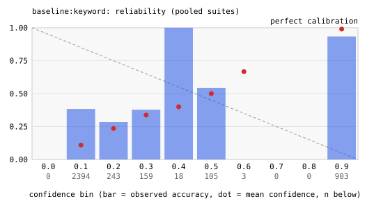

### baseline:majority

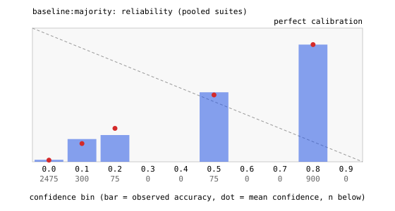

### baseline:random

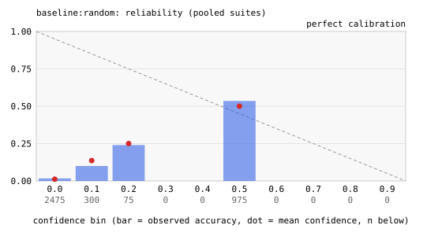

### anthropic:claude-haiku-4-5

### anthropic:claude-sonnet-4-6

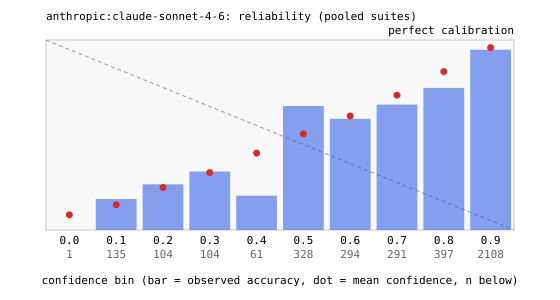

### cerebras:gpt-oss-120b

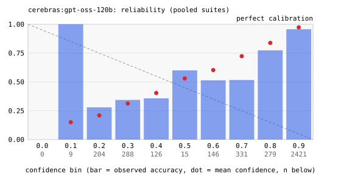

### deepseek:deepseek-chat

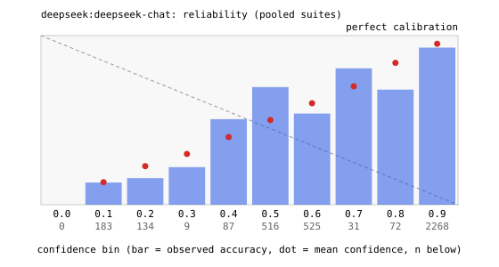

### openai:gpt-5.4-mini

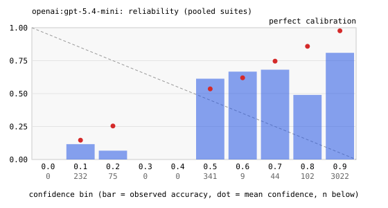

### openai:gpt-5.4-nano

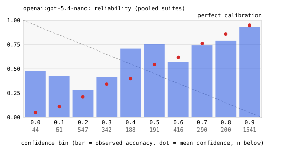

### typesafe:jev

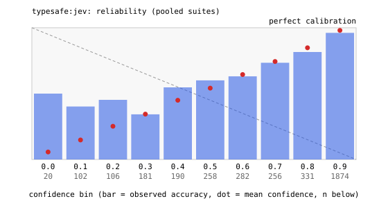

### zai:glm-5.3

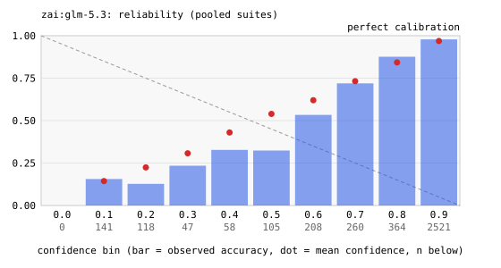

### zai:glm-5.3-flash

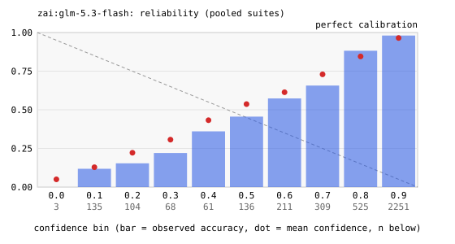

## Machine-readable cell metrics

See `v2.cells.json` next to this file.

## Data and licenses

- banking77 (S1, S4 base items): PolyAI, CC BY 4.0; intent labels
  appear in the raw logs with this attribution.
- UCI SMS spam (S2): research use; item text stays local and is
  scrubbed from the published archive.
- S3, S5 are synthetic and generated by this repository's code
  from seed 20260918.

