# Decision-model benchmark: results

Runs: v1, v1.1, v2-majority-fix.
Source manifests record $28.34 in total (historical totals may use nominal rates or incomplete usage). Recomputed known subtotal for selected cells: $24.23. This is not a complete bill where accounting is marked incomplete.

Every number in this file recomputes from `results.jsonl` and the
manifests in the raw archive. Later runs replace earlier cells
whole; each coverage row names its source run.

Denominators:

- Accuracy and macro-F1 cover valid decisions on gold-labelled items.
  General ECE/Brier use that subset too; S5 no-good diagnostics are separate.
- Completion coverage is completed decisions divided by expected
  decisions; valid coverage is valid decisions divided by expected
  decisions.
- Malformed and failed rates use completed decisions as the
  denominator.
- Cost covers the attempt charges each cell's `cost_scope` names;
  unknown usage is never treated as a measured zero.
- Latency scopes are mixed across source runs; see each cell's source run and protocol version.

## Correction note

## v3 correction notice — 2026-09-26

v3 recomputes reports from the original `v1`, `v1.1`, and
`v2-majority-fix` observations. It makes no new paid measurements. All
five rebuilt suite hashes match the historical manifests. Earlier numeric
reports retain their original values with correction links. All published
raw archives have been sanitized in place.

| Correction | Historical defect | v3 treatment |
|---|---|---|
| SMS archive privacy | Reasoning and arbitrary response/error strings escaped key-based redaction; shared logs bypassed filename checks. | Publish approved S2 metadata only across every archive member. Preserve numeric decision observations. |
| Cost scope | Retry attempts were incompletely recorded; original snapshots lack cached-token prices; gateway invoices and jev's vendor price were unverified. | Verify exact historical snapshots and retain missing rates. Show known subtotals, missing components and nominal historical calculations separately. No current cache rate is applied to old runs. |
| Protocol provenance | Reports ignored top-level protocol versions and could miss mixed execution rules. | Validate protocol versions and fingerprints; explicitly mark the v1/v2 mix. v3 is a report version, not a relabeling of historical executions. |
| S4 stability | All three orders and three repeats were pooled as “position bias.” | Separate within-order repeat disagreement and matched across-order disagreement with counts. Keep pooled instability as a descriptive statistic; order comparisons still contain stochastic variation. |
| S5 confidence | ECE excluded no-good items yet was cited as evidence about them. Prompt instructions differed and jev's native score was treated as a correctness probability. | Report no-good confidence separately from underdetermined correctness calibration. Qualify native scores and historical prompt differences; withdraw the “only jev bluffs” verdict. |
| Headline arithmetic | “Ten times cheaper” and “both GLMs lead spam” contradicted the numbers. | Original nominal nano/jev S1 ratio is 2.486×, about 2.49×. Spam ranks glm-5.3 94.9%, jev 93.0%, flash 91.4%. These costs are not reconciled bills. |
| Uncertainty and threshold use | Repeats could imply independent evidence and confidence plots suggested deployment readiness. | Cluster uncertainty by item (S4 base item) and show descriptive risk/coverage. Select deployment thresholds on separate held-out data. |
| Input provenance and licenses | Mutable Banking77 master, unchecked cached bytes, S4 incorrectly called wholly synthetic, inaccurate SMS license prohibition. | Pin full Banking77 commit and CSV/license hashes, SMS ZIP/member hashes, and verify cache bytes. Retain Banking77 attribution on S4. Current UCI page lists CC BY 4.0; DMB keeps SMS text local as its privacy policy. |

The original pooled S4 changes on 13/100 jev and 37/100 mini base items.
Identical-order repeats also change on 5/100 and 25/100, respectively.
These figures illustrate why the old pooled result cannot identify causal
position bias. Corrected matched denominators and descriptive comparisons
are in the generated report and machine-readable metrics.

S5 no-good-option items have no correct answer. Underdetermined items have
randomly planted reference answers that the state does not reveal. The
historical jev ECE of 0.246 covers only the latter subset. Low-confidence
fractions describe behavior under the historical prompt; they do not prove
honesty or establish a deployable calibrated threshold.

The script `scripts/regenerate_corrections.py` verifies source and price
hashes, captures numerical observations, regenerates v3 and all sanitized
archives, and checks preserved observations before replacement. It never
reads credentials or calls model providers. Source datasets remain local;
public source provenance consists of pinned identifiers and checksums.

## Protocol and data caveats

- Mixed protocol versions merged by explicit policy: v1, v2. Replacement cells from different versions may differ in latency scope, prompt text, and record format; the per-cell source run column says which version each cell came from.
- Cost caveats: some cells report incomplete usage. Unknown usage is not a measured zero; see the cost table markers and the coverage table.
- Confidence semantics differ: LLM scores are prompted probabilities; jev's native score is provider-defined and has not been established as probability of correctness. ECE/Brier for native scores are score-to-outcome diagnostics, not proof of dishonesty or comparable probability calibration.
- S5 legacy ECE/Brier fields cover only underdetermined items with synthetic hidden labels. Separate no-good diagnostics include every valid forced choice as wrong. Scores <= 0.5 are a descriptive cutoff, not an honesty verdict.
- S4 overall flips combine repeat nondeterminism and option-order variation. Within-order and across-order rates use complete blocks with equal observation counts and fixed repeat matching; missing blocks are excluded and counted in the JSON. Across-order disagreement alone does not establish a causal position effect.
- Item-cluster bootstrap intervals use 2,000 deterministic resamples, equal item weights, and S4 base items as clusters. Pairwise differences use common observed items. Repeated responses are not independent examples; intervals do not cover missingness or dataset shift and pairwise intervals are not multiplicity-adjusted.
- Risk/coverage points in the JSON use fixed, unfitted score cutoffs and expected decisions as the coverage denominator. They describe these observations only. Selecting a deployment threshold requires a separate held-out calibration/evaluation split; no deployment cutoff is recommended here.
- Historical v1/v1.1 provider observations used unequal uncertainty instructions: LLMs were explicitly told to report low confidence under uncertainty; jev was not. New shared instructions do not retroactively make those measurements comparable.

## Run notes

- [v1] Free-text provider/run diagnostics are omitted by S2 publication policy; structured protocol and configuration metadata remain.
- [v1.1] Free-text provider/run diagnostics are omitted by S2 publication policy; structured protocol and configuration metadata remain.

## Coverage (expected versus completed decisions)

| contender | suite | status | expected | completed | valid | malformed | failed | completion % | valid % | stop reason | source run |
|---|---|---|---|---|---|---|---|---|---|---|---|
| baseline:keyword | S1 intent77 (77-way banking) | ok | 900 | 900 | 900 | 0 | 0 | 100.0 | 100.0 |  | v1 |
| baseline:keyword | S2 SMS spam (2-way) | ok | 900 | 900 | 900 | 0 | 0 | 100.0 | 100.0 |  | v1 |
| baseline:keyword | S3 cardinality sweep | ok | 825 | 825 | 825 | 0 | 0 | 100.0 | 100.0 |  | v1 |
| baseline:keyword | S4 order stability | ok | 900 | 900 | 900 | 0 | 0 | 100.0 | 100.0 |  | v1 |
| baseline:keyword | S5 forced uncertainty (score diagnostics) | ok | 600 | 600 | 600 | 0 | 0 | 100.0 | 100.0 |  | v1 |
| baseline:majority | S1 intent77 (77-way banking) | ok | 900 | 900 | 900 | 0 | 0 | 100.0 | 100.0 |  | v2-majority-fix |
| baseline:majority | S2 SMS spam (2-way) | ok | 900 | 900 | 900 | 0 | 0 | 100.0 | 100.0 |  | v1 |
| baseline:majority | S3 cardinality sweep | ok | 825 | 825 | 825 | 0 | 0 | 100.0 | 100.0 |  | v1 |
| baseline:majority | S4 order stability | ok | 900 | 900 | 900 | 0 | 0 | 100.0 | 100.0 |  | v2-majority-fix |
| baseline:majority | S5 forced uncertainty (score diagnostics) | ok | 600 | 600 | 600 | 0 | 0 | 100.0 | 100.0 |  | v1 |
| baseline:random | S1 intent77 (77-way banking) | ok | 900 | 900 | 900 | 0 | 0 | 100.0 | 100.0 |  | v1 |
| baseline:random | S2 SMS spam (2-way) | ok | 900 | 900 | 900 | 0 | 0 | 100.0 | 100.0 |  | v1 |
| baseline:random | S3 cardinality sweep | ok | 825 | 825 | 825 | 0 | 0 | 100.0 | 100.0 |  | v1 |
| baseline:random | S4 order stability | ok | 900 | 900 | 900 | 0 | 0 | 100.0 | 100.0 |  | v1 |
| baseline:random | S5 forced uncertainty (score diagnostics) | ok | 600 | 600 | 600 | 0 | 0 | 100.0 | 100.0 |  | v1 |
| anthropic:claude-haiku-4-5 | S1 intent77 (77-way banking) | ok | 900 | 900 | 900 | 0 | 0 | 100.0 | 100.0 |  | v1 |
| anthropic:claude-haiku-4-5 | S2 SMS spam (2-way) | ok | 900 | 900 | 900 | 0 | 0 | 100.0 | 100.0 |  | v1 |
| anthropic:claude-haiku-4-5 | S3 cardinality sweep | ok | 825 | 825 | 822 | 0 | 3 | 100.0 | 99.6 |  | v1 |
| anthropic:claude-haiku-4-5 | S4 order stability | ok | 900 | 900 | 810 | 0 | 90 | 100.0 | 90.0 |  | v1 |
| anthropic:claude-haiku-4-5 | S5 forced uncertainty (score diagnostics) | ok | 600 | 600 | 600 | 0 | 0 | 100.0 | 100.0 |  | v1 |
| anthropic:claude-sonnet-4-6 | S1 intent77 (77-way banking) | ok | 900 | 900 | 900 | 0 | 0 | 100.0 | 100.0 |  | v1 |
| anthropic:claude-sonnet-4-6 | S2 SMS spam (2-way) | ok | 900 | 900 | 900 | 0 | 0 | 100.0 | 100.0 |  | v1 |
| anthropic:claude-sonnet-4-6 | S3 cardinality sweep | ok | 825 | 825 | 825 | 0 | 0 | 100.0 | 100.0 |  | v1 |
| anthropic:claude-sonnet-4-6 | S4 order stability | ok | 900 | 900 | 899 | 0 | 1 | 100.0 | 99.9 |  | v1 |
| anthropic:claude-sonnet-4-6 | S5 forced uncertainty (score diagnostics) | ok | 600 | 600 | 599 | 1 | 0 | 100.0 | 99.8 |  | v1 |
| cerebras:gpt-oss-120b | S1 intent77 (77-way banking) | ok | 900 | 900 | 900 | 0 | 0 | 100.0 | 100.0 |  | v1 |
| cerebras:gpt-oss-120b | S2 SMS spam (2-way) | ok | 900 | 900 | 900 | 0 | 0 | 100.0 | 100.0 |  | v1 |
| cerebras:gpt-oss-120b | S3 cardinality sweep | ok | 825 | 825 | 819 | 6 | 0 | 100.0 | 99.3 |  | v1 |
| cerebras:gpt-oss-120b | S4 order stability | ok | 900 | 900 | 900 | 0 | 0 | 100.0 | 100.0 |  | v1 |
| cerebras:gpt-oss-120b | S5 forced uncertainty (score diagnostics) | ok | 600 | 600 | 600 | 0 | 0 | 100.0 | 100.0 |  | v1 |
| deepseek:deepseek-chat | S1 intent77 (77-way banking) | ok | 900 | 900 | 900 | 0 | 0 | 100.0 | 100.0 |  | v1 |
| deepseek:deepseek-chat | S2 SMS spam (2-way) | ok | 900 | 900 | 900 | 0 | 0 | 100.0 | 100.0 |  | v1 |
| deepseek:deepseek-chat | S3 cardinality sweep | ok | 825 | 825 | 825 | 0 | 0 | 100.0 | 100.0 |  | v1 |
| deepseek:deepseek-chat | S4 order stability | ok | 900 | 900 | 900 | 0 | 0 | 100.0 | 100.0 |  | v1 |
| deepseek:deepseek-chat | S5 forced uncertainty (score diagnostics) | ok | 600 | 600 | 600 | 0 | 0 | 100.0 | 100.0 |  | v1 |
| openai:gpt-5.4-mini | S1 intent77 (77-way banking) | ok | 900 | 900 | 900 | 0 | 0 | 100.0 | 100.0 |  | v1 |
| openai:gpt-5.4-mini | S2 SMS spam (2-way) | ok | 900 | 900 | 900 | 0 | 0 | 100.0 | 100.0 |  | v1 |
| openai:gpt-5.4-mini | S3 cardinality sweep | ok | 825 | 825 | 825 | 0 | 0 | 100.0 | 100.0 |  | v1 |
| openai:gpt-5.4-mini | S4 order stability | ok | 900 | 900 | 900 | 0 | 0 | 100.0 | 100.0 |  | v1 |
| openai:gpt-5.4-mini | S5 forced uncertainty (score diagnostics) | ok | 600 | 600 | 600 | 0 | 0 | 100.0 | 100.0 |  | v1 |
| openai:gpt-5.4-nano | S1 intent77 (77-way banking) | ok | 900 | 900 | 900 | 0 | 0 | 100.0 | 100.0 |  | v1 |
| openai:gpt-5.4-nano | S2 SMS spam (2-way) | ok | 900 | 900 | 900 | 0 | 0 | 100.0 | 100.0 |  | v1 |
| openai:gpt-5.4-nano | S3 cardinality sweep | ok | 825 | 825 | 824 | 1 | 0 | 100.0 | 99.9 |  | v1 |
| openai:gpt-5.4-nano | S4 order stability | ok | 900 | 900 | 896 | 4 | 0 | 100.0 | 99.6 |  | v1 |
| openai:gpt-5.4-nano | S5 forced uncertainty (score diagnostics) | ok | 600 | 600 | 563 | 37 | 0 | 100.0 | 93.8 |  | v1 |
| typesafe:jev | S1 intent77 (77-way banking) | ok | 900 | 900 | 900 | 0 | 0 | 100.0 | 100.0 |  | v1.1 |
| typesafe:jev | S2 SMS spam (2-way) | ok | 900 | 900 | 900 | 0 | 0 | 100.0 | 100.0 |  | v1.1 |
| typesafe:jev | S3 cardinality sweep | ok | 825 | 825 | 600 | 0 | 225 | 100.0 | 72.7 |  | v1.1 |
| typesafe:jev | S4 order stability | ok | 900 | 900 | 900 | 0 | 0 | 100.0 | 100.0 |  | v1.1 |
| typesafe:jev | S5 forced uncertainty (score diagnostics) | ok | 600 | 600 | 600 | 0 | 0 | 100.0 | 100.0 |  | v1.1 |
| zai:glm-5.3 | S1 intent77 (77-way banking) | ok | 900 | 900 | 900 | 0 | 0 | 100.0 | 100.0 |  | v1 |
| zai:glm-5.3 | S2 SMS spam (2-way) | ok | 900 | 900 | 898 | 0 | 2 | 100.0 | 99.8 |  | v1 |
| zai:glm-5.3 | S3 cardinality sweep | ok | 825 | 825 | 825 | 0 | 0 | 100.0 | 100.0 |  | v1 |
| zai:glm-5.3 | S4 order stability | ok | 900 | 900 | 899 | 0 | 1 | 100.0 | 99.9 |  | v1 |
| zai:glm-5.3 | S5 forced uncertainty (score diagnostics) | ok | 600 | 600 | 600 | 0 | 0 | 100.0 | 100.0 |  | v1 |
| zai:glm-5.3-flash | S1 intent77 (77-way banking) | ok | 900 | 900 | 881 | 3 | 16 | 100.0 | 97.9 |  | v1 |
| zai:glm-5.3-flash | S2 SMS spam (2-way) | ok | 900 | 900 | 899 | 0 | 1 | 100.0 | 99.9 |  | v1 |
| zai:glm-5.3-flash | S3 cardinality sweep | ok | 825 | 825 | 825 | 0 | 0 | 100.0 | 100.0 |  | v1 |
| zai:glm-5.3-flash | S4 order stability | ok | 900 | 900 | 899 | 1 | 0 | 100.0 | 99.9 |  | v1 |
| zai:glm-5.3-flash | S5 forced uncertainty (score diagnostics) | ok | 600 | 600 | 599 | 1 | 0 | 100.0 | 99.8 |  | v1 |

A cell is partial when it stopped early or returned malformed or
failed decisions. Empty, failed, and skipped cells stay listed
with their reasons.

## Accuracy (percent, valid rows, gold items) (*: partial coverage; see the coverage table)

| contender | S1 intent77 (77-way banking) | S2 SMS spam (2-way) | S3 cardinality sweep | S4 order stability | S5 forced uncertainty (score diagnostics) |
|---|---|---|---|---|---|
| baseline:keyword | 29.3 | 54.0 | 100.0 | 38.0 | 16.0 |
| baseline:majority | 1.3 | 87.7 | 8.0 | 1.0 | 18.0 |
| baseline:random | 1.7 | 53.7 | 5.5 | 2.7 | 15.0 |
| anthropic:claude-haiku-4-5 | 75.7 | 76.3 | 100.0* | 79.6* | 18.3 |
| anthropic:claude-sonnet-4-6 | 74.8 | 77.7 | 100.0 | 79.2* | 18.7* |
| cerebras:gpt-oss-120b | 81.3 | 73.0 | 99.6* | 82.3 | 17.0 |
| deepseek:deepseek-chat | 76.2 | 75.9 | 100.0 | 75.1 | 14.7 |
| openai:gpt-5.4-mini | 74.0 | 66.1 | 99.8 | 73.1 | 10.7 |
| openai:gpt-5.4-nano | 70.9 | 67.3 | 93.2* | 68.6* | 13.7* |
| typesafe:jev | 76.3 | 93.0 | 100.0* | 76.7 | 14.3 |
| zai:glm-5.3 | 80.4 | 94.9* | 100.0 | 82.0* | 15.7 |
| zai:glm-5.3-flash | 79.0* | 91.4* | 100.0 | 82.4* | 13.7* |

## Macro-F1 (stable option labels; absent classes count as 0) (*: partial coverage; see the coverage table). Not applicable on S3 and S5: their option texts vary between items, so positions are not classes

| contender | S1 intent77 (77-way banking) | S2 SMS spam (2-way) | S3 cardinality sweep | S4 order stability | S5 forced uncertainty (score diagnostics) |
|---|---|---|---|---|---|
| baseline:keyword | 0.292 | 0.459 | n/a | 0.337 | n/a |
| baseline:majority | 0.000 | 0.467 | n/a | 0.000 | n/a |
| baseline:random | 0.016 | 0.428 | n/a | 0.027 | n/a |
| anthropic:claude-haiku-4-5 | 0.734 | 0.672 | n/a | 0.754* | n/a |
| anthropic:claude-sonnet-4-6 | 0.724 | 0.686 | n/a | 0.747* | n/a |
| cerebras:gpt-oss-120b | 0.793 | 0.642 | n/a | 0.783 | n/a |
| deepseek:deepseek-chat | 0.743 | 0.661 | n/a | 0.708 | n/a |
| openai:gpt-5.4-mini | 0.721 | 0.585 | n/a | 0.696 | n/a |
| openai:gpt-5.4-nano | 0.696 | 0.593 | n/a | 0.632* | n/a |
| typesafe:jev | 0.742 | 0.864 | n/a | 0.716 | n/a |
| zai:glm-5.3 | 0.782 | 0.895* | n/a | 0.779* | n/a |
| zai:glm-5.3-flash | 0.770* | 0.840* | n/a | 0.784* | n/a |

## ECE diagnostic (gold-labelled only; S5 underdetermined only)

| contender | S1 intent77 (77-way banking) | S2 SMS spam (2-way) | S3 cardinality sweep | S4 order stability | S5 forced uncertainty (score diagnostics) |
|---|---|---|---|---|---|
| baseline:keyword | 0.140 | 0.437 | 0.010 | 0.223 | 0.186 |
| baseline:majority | 0.000 | 0.000 | 0.016 | 0.003 | 0.037 |
| baseline:random | 0.004 | 0.037 | 0.013 | 0.014 | 0.018 |
| anthropic:claude-haiku-4-5 | 0.078 | 0.106 | 0.002 | 0.042 | 0.044 |
| anthropic:claude-sonnet-4-6 | 0.081 | 0.116 | 0.002 | 0.046 | 0.049 |
| cerebras:gpt-oss-120b | 0.086 | 0.125 | 0.010 | 0.065 | 0.122 |
| deepseek:deepseek-chat | 0.085 | 0.149 | 0.003 | 0.062 | 0.039 |
| openai:gpt-5.4-mini | 0.226 | 0.189 | 0.007 | 0.229 | 0.066 |
| openai:gpt-5.4-nano | 0.090 | 0.197 | 0.046 | 0.055 | 0.116 |
| typesafe:jev | 0.083 | 0.249 | 0.021 | 0.059 | 0.246 |
| zai:glm-5.3 | 0.043 | 0.042 | 0.001 | 0.071 | 0.049 |
| zai:glm-5.3-flash | 0.054 | 0.047 | 0.001 | 0.046 | 0.073 |

## Brier diagnostic (gold-labelled only; S5 underdetermined only)

| contender | S1 intent77 (77-way banking) | S2 SMS spam (2-way) | S3 cardinality sweep | S4 order stability | S5 forced uncertainty (score diagnostics) |
|---|---|---|---|---|---|
| baseline:keyword | 0.231 | 0.439 | 0.000 | 0.278 | 0.232 |
| baseline:majority | 0.013 | 0.108 | 0.053 | 0.010 | 0.149 |
| baseline:random | 0.016 | 0.250 | 0.030 | 0.026 | 0.126 |
| anthropic:claude-haiku-4-5 | 0.146 | 0.193 | 0.000 | 0.117 | 0.149 |
| anthropic:claude-sonnet-4-6 | 0.153 | 0.187 | 0.000 | 0.123 | 0.165 |
| cerebras:gpt-oss-120b | 0.124 | 0.194 | 0.000 | 0.107 | 0.150 |
| deepseek:deepseek-chat | 0.160 | 0.201 | 0.000 | 0.140 | 0.127 |
| openai:gpt-5.4-mini | 0.237 | 0.270 | 0.002 | 0.238 | 0.106 |
| openai:gpt-5.4-nano | 0.176 | 0.254 | 0.059 | 0.172 | 0.132 |
| typesafe:jev | 0.143 | 0.162 | 0.004 | 0.129 | 0.211 |
| zai:glm-5.3 | 0.116 | 0.050 | 0.000 | 0.099 | 0.135 |
| zai:glm-5.3-flash | 0.130 | 0.071 | 0.000 | 0.102 | 0.137 |

## Malformed rate (percent of completed decisions)

| contender | S1 intent77 (77-way banking) | S2 SMS spam (2-way) | S3 cardinality sweep | S4 order stability | S5 forced uncertainty (score diagnostics) |
|---|---|---|---|---|---|
| baseline:keyword | 0.0 | 0.0 | 0.0 | 0.0 | 0.0 |
| baseline:majority | 0.0 | 0.0 | 0.0 | 0.0 | 0.0 |
| baseline:random | 0.0 | 0.0 | 0.0 | 0.0 | 0.0 |
| anthropic:claude-haiku-4-5 | 0.0 | 0.0 | 0.0 | 0.0 | 0.0 |
| anthropic:claude-sonnet-4-6 | 0.0 | 0.0 | 0.0 | 0.0 | 0.2 |
| cerebras:gpt-oss-120b | 0.0 | 0.0 | 0.7 | 0.0 | 0.0 |
| deepseek:deepseek-chat | 0.0 | 0.0 | 0.0 | 0.0 | 0.0 |
| openai:gpt-5.4-mini | 0.0 | 0.0 | 0.0 | 0.0 | 0.0 |
| openai:gpt-5.4-nano | 0.0 | 0.0 | 0.1 | 0.4 | 6.2 |
| typesafe:jev | 0.0 | 0.0 | 0.0 | 0.0 | 0.0 |
| zai:glm-5.3 | 0.0 | 0.0 | 0.0 | 0.0 | 0.0 |
| zai:glm-5.3-flash | 0.3 | 0.0 | 0.0 | 0.1 | 0.2 |

## Failed attempts (rate, percent of completed decisions)

| contender | S1 intent77 (77-way banking) | S2 SMS spam (2-way) | S3 cardinality sweep | S4 order stability | S5 forced uncertainty (score diagnostics) |
|---|---|---|---|---|---|
| baseline:keyword | 0.0 | 0.0 | 0.0 | 0.0 | 0.0 |
| baseline:majority | 0.0 | 0.0 | 0.0 | 0.0 | 0.0 |
| baseline:random | 0.0 | 0.0 | 0.0 | 0.0 | 0.0 |
| anthropic:claude-haiku-4-5 | 0.0 | 0.0 | 0.4 | 10.0 | 0.0 |
| anthropic:claude-sonnet-4-6 | 0.0 | 0.0 | 0.0 | 0.1 | 0.0 |
| cerebras:gpt-oss-120b | 0.0 | 0.0 | 0.0 | 0.0 | 0.0 |
| deepseek:deepseek-chat | 0.0 | 0.0 | 0.0 | 0.0 | 0.0 |
| openai:gpt-5.4-mini | 0.0 | 0.0 | 0.0 | 0.0 | 0.0 |
| openai:gpt-5.4-nano | 0.0 | 0.0 | 0.0 | 0.0 | 0.0 |
| typesafe:jev | 0.0 | 0.0 | 27.3 | 0.0 | 0.0 |
| zai:glm-5.3 | 0.0 | 0.2 | 0.0 | 0.1 | 0.0 |
| zai:glm-5.3-flash | 1.8 | 0.1 | 0.0 | 0.0 | 0.0 |

## Latency p50 (ms)

| contender | S1 intent77 (77-way banking) | S2 SMS spam (2-way) | S3 cardinality sweep | S4 order stability | S5 forced uncertainty (score diagnostics) |
|---|---|---|---|---|---|
| baseline:keyword | 0.1 | 0.0 | 0.1 | 0.1 | 0.0 |
| baseline:majority | 0.0 | 0.0 | 0.0 | 0.0 | 0.0 |
| baseline:random | 0.0 | 0.0 | 0.0 | 0.0 | 0.0 |
| anthropic:claude-haiku-4-5 | 4,360 | 4,353 | 2,425 | 2,462 | 2,911 |
| anthropic:claude-sonnet-4-6 | 2,371 | 2,236 | 1,798 | 2,008 | 2,649 |
| cerebras:gpt-oss-120b | 331 | 306 | 303 | 346 | 333 |
| deepseek:deepseek-chat | 776 | 756 | 764 | 752 | 731 |
| openai:gpt-5.4-mini | 660 | 668 | 675 | 685 | 710 |
| openai:gpt-5.4-nano | 684 | 711 | 782 | 766 | 747 |
| typesafe:jev | 274 | 267 | 273 | 276 | 264 |
| zai:glm-5.3 | 3,425 | 3,803 | 2,354 | 3,503 | 5,615 |
| zai:glm-5.3-flash | 3,331 | 3,498 | 2,041 | 3,171 | 3,407 |

## Latency p95 (ms)

| contender | S1 intent77 (77-way banking) | S2 SMS spam (2-way) | S3 cardinality sweep | S4 order stability | S5 forced uncertainty (score diagnostics) |
|---|---|---|---|---|---|
| baseline:keyword | 0.1 | 0.0 | 0.2 | 0.1 | 0.0 |
| baseline:majority | 0.1 | 0.0 | 0.0 | 0.1 | 0.0 |
| baseline:random | 0.0 | 0.0 | 0.0 | 0.0 | 0.0 |
| anthropic:claude-haiku-4-5 | 7,201 | 6,772 | 6,269 | 6,616 | 8,142 |
| anthropic:claude-sonnet-4-6 | 7,185 | 6,033 | 6,332 | 9,217 | 10,416 |
| cerebras:gpt-oss-120b | 533 | 617 | 527 | 711 | 713 |
| deepseek:deepseek-chat | 1,028 | 1,023 | 1,057 | 1,026 | 1,007 |
| openai:gpt-5.4-mini | 937 | 958 | 991 | 1,016 | 997 |
| openai:gpt-5.4-nano | 1,000 | 978 | 1,063 | 1,055 | 975 |
| typesafe:jev | 412 | 344 | 393 | 481 | 357 |
| zai:glm-5.3 | 15,698 | 8,370 | 4,214 | 16,166 | 18,852 |
| zai:glm-5.3-flash | 16,860 | 8,171 | 3,289 | 11,847 | 8,114 |

## Latency p99 (ms)

| contender | S1 intent77 (77-way banking) | S2 SMS spam (2-way) | S3 cardinality sweep | S4 order stability | S5 forced uncertainty (score diagnostics) |
|---|---|---|---|---|---|
| baseline:keyword | 0.1 | 0.0 | 2.3 | 0.1 | 0.0 |
| baseline:majority | 0.3 | 0.0 | 0.0 | 0.2 | 0.0 |
| baseline:random | 0.0 | 0.0 | 0.0 | 0.0 | 0.0 |
| anthropic:claude-haiku-4-5 | 12,617 | 11,337 | 12,753 | 13,758 | 15,049 |
| anthropic:claude-sonnet-4-6 | 14,440 | 10,303 | 13,356 | 28,457 | 27,448 |
| cerebras:gpt-oss-120b | 1,031 | 1,326 | 1,077 | 1,341 | 2,024 |
| deepseek:deepseek-chat | 1,108 | 1,108 | 1,187 | 1,176 | 1,159 |
| openai:gpt-5.4-mini | 1,126 | 1,127 | 1,392 | 1,448 | 1,283 |
| openai:gpt-5.4-nano | 1,186 | 1,213 | 1,246 | 1,271 | 1,124 |
| typesafe:jev | 805 | 553 | 743 | 850 | 884 |
| zai:glm-5.3 | 36,858 | 20,814 | 7,977 | 37,182 | 34,093 |
| zai:glm-5.3-flash | 24,500 | 14,343 | 5,354 | 22,376 | 12,124 |

## Known cost per 1,000 completed decisions (USD) (†: incomplete usage; see the coverage table)

| contender | S1 intent77 (77-way banking) | S2 SMS spam (2-way) | S3 cardinality sweep | S4 order stability | S5 forced uncertainty (score diagnostics) |
|---|---|---|---|---|---|
| baseline:keyword | $0.00 | $0.00 | $0.00 | $0.00 | $0.00 |
| baseline:majority | $0.00 | $0.00 | $0.00 | $0.00 | $0.00 |
| baseline:random | $0.00 | $0.00 | $0.00 | $0.00 | $0.00 |
| anthropic:claude-haiku-4-5 | $0.82† | $0.50† | $1.25† | $0.78† | $0.55† |
| anthropic:claude-sonnet-4-6 | $2.48† | $1.52† | $4.00† | $2.44† | $1.60† |
| cerebras:gpt-oss-120b | $0.20† | $0.11† | $0.22† | $0.21† | $0.13† |
| deepseek:deepseek-chat | $0.13† | $0.07† | $0.18† | $0.13† | $0.08 |
| openai:gpt-5.4-mini | $0.69 | $0.24 | $0.97† | $0.69 | $0.26† |
| openai:gpt-5.4-nano | $0.19 | $0.07 | $0.27† | $0.18† | $0.07† |
| typesafe:jev | $0.07 | $0.01 | $0.06† | $0.07 | $0.02 |
| zai:glm-5.3 | $1.65† | $1.00† | $0.97† | $1.66† | $1.95† |
| zai:glm-5.3-flash | $0.16† | $0.09† | $0.12† | $0.17† | $0.14† |

## S4 overall flip rate (all repeats and orders; percent of observed bases)

| contender | S4 order stability |
|---|---|
| baseline:keyword | 51.0 |
| baseline:majority | 0.0 |
| baseline:random | 100.0 |
| anthropic:claude-haiku-4-5 | 34.0 |
| anthropic:claude-sonnet-4-6 | 30.0 |
| cerebras:gpt-oss-120b | 15.0 |
| deepseek:deepseek-chat | 30.0 |
| openai:gpt-5.4-mini | 37.0 |
| openai:gpt-5.4-nano | 33.0 |
| typesafe:jev | 13.0 |
| zai:glm-5.3 | 16.0 |
| zai:glm-5.3-flash | 24.0 |

## S4 mean confidence range across all repeats and orders

| contender | S4 order stability |
|---|---|
| baseline:keyword | 0.000 |
| baseline:majority | 0.000 |
| baseline:random | 0.000 |
| anthropic:claude-haiku-4-5 | 0.207 |
| anthropic:claude-sonnet-4-6 | 0.218 |
| cerebras:gpt-oss-120b | 0.077 |
| deepseek:deepseek-chat | 0.124 |
| openai:gpt-5.4-mini | 0.046 |
| openai:gpt-5.4-nano | 0.197 |
| typesafe:jev | 0.092 |
| zai:glm-5.3 | 0.179 |
| zai:glm-5.3-flash | 0.196 |

## S5 score <= 0.5 on no-good items (percent; score semantics differ)

| contender | S5 forced uncertainty (score diagnostics) |
|---|---|
| baseline:keyword | 79.0 |
| baseline:majority | 100.0 |
| baseline:random | 100.0 |
| anthropic:claude-haiku-4-5 | 98.7 |
| anthropic:claude-sonnet-4-6 | 97.7 |
| cerebras:gpt-oss-120b | 99.0 |
| deepseek:deepseek-chat | 100.0 |
| openai:gpt-5.4-mini | 64.7 |
| openai:gpt-5.4-nano | 97.3 |
| typesafe:jev | 49.7 |
| zai:glm-5.3 | 98.3 |
| zai:glm-5.3-flash | 99.7 |

## S5 mean confidence on no-good items

| contender | S5 forced uncertainty (score diagnostics) |
|---|---|
| baseline:keyword | 0.358 |
| baseline:majority | 0.183 |
| baseline:random | 0.183 |
| anthropic:claude-haiku-4-5 | 0.161 |
| anthropic:claude-sonnet-4-6 | 0.173 |
| cerebras:gpt-oss-120b | 0.248 |
| deepseek:deepseek-chat | 0.069 |
| openai:gpt-5.4-mini | 0.446 |
| openai:gpt-5.4-nano | 0.137 |
| typesafe:jev | 0.543 |
| zai:glm-5.3 | 0.180 |
| zai:glm-5.3-flash | 0.123 |

## S4 within-order repeat disagreement (complete matched blocks, percent)

| contender | S4 order stability |
|---|---|
| baseline:keyword | 0.0 |
| baseline:majority | 0.0 |
| baseline:random | 0.0 |
| anthropic:claude-haiku-4-5 | 14.2 |
| anthropic:claude-sonnet-4-6 | 12.7 |
| cerebras:gpt-oss-120b | 0.3 |
| deepseek:deepseek-chat | 4.0 |
| openai:gpt-5.4-mini | 10.0 |
| openai:gpt-5.4-nano | 2.7 |
| typesafe:jev | 2.3 |
| zai:glm-5.3 | 6.0 |
| zai:glm-5.3-flash | 12.0 |

## S4 across-order disagreement (complete matched-repeat blocks, percent)

| contender | S4 order stability |
|---|---|
| baseline:keyword | 51.0 |
| baseline:majority | 0.0 |
| baseline:random | 100.0 |
| anthropic:claude-haiku-4-5 | 25.3 |
| anthropic:claude-sonnet-4-6 | 23.7 |
| cerebras:gpt-oss-120b | 14.7 |
| deepseek:deepseek-chat | 26.3 |
| openai:gpt-5.4-mini | 30.0 |
| openai:gpt-5.4-nano | 29.6 |
| typesafe:jev | 11.7 |
| zai:glm-5.3 | 12.0 |
| zai:glm-5.3-flash | 14.7 |

## S5 no-good ECE diagnostic (every valid choice is wrong)

| contender | S5 forced uncertainty (score diagnostics) |
|---|---|
| baseline:keyword | 0.358 |
| baseline:majority | 0.183 |
| baseline:random | 0.183 |
| anthropic:claude-haiku-4-5 | 0.161 |
| anthropic:claude-sonnet-4-6 | 0.173 |
| cerebras:gpt-oss-120b | 0.248 |
| deepseek:deepseek-chat | 0.069 |
| openai:gpt-5.4-mini | 0.446 |
| openai:gpt-5.4-nano | 0.137 |
| typesafe:jev | 0.543 |
| zai:glm-5.3 | 0.180 |
| zai:glm-5.3-flash | 0.123 |

## S5 no-good Brier diagnostic (every valid choice is wrong)

| contender | S5 forced uncertainty (score diagnostics) |
|---|---|
| baseline:keyword | 0.249 |
| baseline:majority | 0.036 |
| baseline:random | 0.036 |
| anthropic:claude-haiku-4-5 | 0.037 |
| anthropic:claude-sonnet-4-6 | 0.046 |
| cerebras:gpt-oss-120b | 0.067 |
| deepseek:deepseek-chat | 0.013 |
| openai:gpt-5.4-mini | 0.362 |
| openai:gpt-5.4-nano | 0.037 |
| typesafe:jev | 0.376 |
| zai:glm-5.3 | 0.042 |
| zai:glm-5.3-flash | 0.019 |

## Cost accounting completeness

| contender | suite | complete | scope | limitation |
|---|---|---|---|---|
| anthropic:claude-haiku-4-5 | s1_intent77 | no | final-attempt usage of completed decisions | unverified historical cache read rate; 3 decisions retried; the discarded first attempts' usage was not recorded, so cost is a lower bound |
| anthropic:claude-haiku-4-5 | s2_spam | no | final-attempt usage of completed decisions | unverified historical cache read rate; 5 decisions retried; the discarded first attempts' usage was not recorded, so cost is a lower bound |
| anthropic:claude-haiku-4-5 | s3_cardinality | no | final-attempt usage of completed decisions | missing or invalid token usage; unverified historical cache read rate; 6 decisions retried; the discarded first attempts' usage was not recorded, so cost is a lower bound |
| anthropic:claude-haiku-4-5 | s4_order | no | final-attempt usage of completed decisions | missing or invalid token usage; unverified historical cache read rate; 143 decisions retried; the discarded first attempts' usage was not recorded, so cost is a lower bound |
| anthropic:claude-haiku-4-5 | s5_confidence | no | final-attempt usage of completed decisions | unverified historical cache read rate |
| anthropic:claude-sonnet-4-6 | s1_intent77 | no | final-attempt usage of completed decisions | unverified historical cache read rate; 5 decisions retried; the discarded first attempts' usage was not recorded, so cost is a lower bound |
| anthropic:claude-sonnet-4-6 | s2_spam | no | final-attempt usage of completed decisions | unverified historical cache read rate; 2 decisions retried; the discarded first attempts' usage was not recorded, so cost is a lower bound |
| anthropic:claude-sonnet-4-6 | s3_cardinality | no | final-attempt usage of completed decisions | unverified historical cache read rate |
| anthropic:claude-sonnet-4-6 | s4_order | no | final-attempt usage of completed decisions | missing or invalid token usage; unverified historical cache read rate; 8 decisions retried; the discarded first attempts' usage was not recorded, so cost is a lower bound |
| anthropic:claude-sonnet-4-6 | s5_confidence | no | final-attempt usage of completed decisions | missing or invalid token usage; unverified historical cache read rate; 5 decisions retried; the discarded first attempts' usage was not recorded, so cost is a lower bound |
| baseline:keyword | s1_intent77 | yes | no billable calls |  |
| baseline:keyword | s2_spam | yes | no billable calls |  |
| baseline:keyword | s3_cardinality | yes | no billable calls |  |
| baseline:keyword | s4_order | yes | no billable calls |  |
| baseline:keyword | s5_confidence | yes | no billable calls |  |
| baseline:majority | s1_intent77 | yes | no billable calls |  |
| baseline:majority | s2_spam | yes | no billable calls |  |
| baseline:majority | s3_cardinality | yes | no billable calls |  |
| baseline:majority | s4_order | yes | no billable calls |  |
| baseline:majority | s5_confidence | yes | no billable calls |  |
| baseline:random | s1_intent77 | yes | no billable calls |  |
| baseline:random | s2_spam | yes | no billable calls |  |
| baseline:random | s3_cardinality | yes | no billable calls |  |
| baseline:random | s4_order | yes | no billable calls |  |
| baseline:random | s5_confidence | yes | no billable calls |  |
| cerebras:gpt-oss-120b | s1_intent77 | no | final-attempt usage of completed decisions | unverified historical cache read rate |
| cerebras:gpt-oss-120b | s2_spam | no | final-attempt usage of completed decisions | unverified historical cache read rate |
| cerebras:gpt-oss-120b | s3_cardinality | no | final-attempt usage of completed decisions | missing or invalid token usage; unverified historical cache read rate; 6 decisions retried; the discarded first attempts' usage was not recorded, so cost is a lower bound |
| cerebras:gpt-oss-120b | s4_order | no | final-attempt usage of completed decisions | unverified historical cache read rate |
| cerebras:gpt-oss-120b | s5_confidence | no | final-attempt usage of completed decisions | unverified historical cache read rate |
| deepseek:deepseek-chat | s1_intent77 | no | final-attempt usage of completed decisions | unverified historical cache read rate; 1 decisions retried; the discarded first attempts' usage was not recorded, so cost is a lower bound |
| deepseek:deepseek-chat | s2_spam | no | final-attempt usage of completed decisions | unverified historical cache read rate |
| deepseek:deepseek-chat | s3_cardinality | no | final-attempt usage of completed decisions | unverified historical cache read rate; 1 decisions retried; the discarded first attempts' usage was not recorded, so cost is a lower bound |
| deepseek:deepseek-chat | s4_order | no | final-attempt usage of completed decisions | unverified historical cache read rate |
| deepseek:deepseek-chat | s5_confidence | yes | final-attempt usage of completed decisions |  |
| openai:gpt-5.4-mini | s1_intent77 | yes | final-attempt usage of completed decisions |  |
| openai:gpt-5.4-mini | s2_spam | yes | final-attempt usage of completed decisions |  |
| openai:gpt-5.4-mini | s3_cardinality | no | final-attempt usage of completed decisions | unverified historical cache read rate |
| openai:gpt-5.4-mini | s4_order | yes | final-attempt usage of completed decisions |  |
| openai:gpt-5.4-mini | s5_confidence | no | final-attempt usage of completed decisions | 1 decisions retried; the discarded first attempts' usage was not recorded, so cost is a lower bound |
| openai:gpt-5.4-nano | s1_intent77 | yes | final-attempt usage of completed decisions |  |
| openai:gpt-5.4-nano | s2_spam | yes | final-attempt usage of completed decisions |  |
| openai:gpt-5.4-nano | s3_cardinality | no | final-attempt usage of completed decisions | missing or invalid token usage; unverified historical cache read rate; 3 decisions retried; the discarded first attempts' usage was not recorded, so cost is a lower bound |
| openai:gpt-5.4-nano | s4_order | no | final-attempt usage of completed decisions | missing or invalid token usage; 4 decisions retried; the discarded first attempts' usage was not recorded, so cost is a lower bound |
| openai:gpt-5.4-nano | s5_confidence | no | final-attempt usage of completed decisions | missing or invalid token usage; 41 decisions retried; the discarded first attempts' usage was not recorded, so cost is a lower bound |
| typesafe:jev | s1_intent77 | yes | final-attempt usage of completed decisions |  |
| typesafe:jev | s2_spam | yes | final-attempt usage of completed decisions |  |
| typesafe:jev | s3_cardinality | no | final-attempt usage of completed decisions | missing or invalid token usage |
| typesafe:jev | s4_order | yes | final-attempt usage of completed decisions |  |
| typesafe:jev | s5_confidence | yes | final-attempt usage of completed decisions |  |
| zai:glm-5.3 | s1_intent77 | no | final-attempt usage of completed decisions | unverified historical cache read rate; 3 decisions retried; the discarded first attempts' usage was not recorded, so cost is a lower bound |
| zai:glm-5.3 | s2_spam | no | final-attempt usage of completed decisions | missing or invalid token usage; unverified historical cache read rate; 4 decisions retried; the discarded first attempts' usage was not recorded, so cost is a lower bound |
| zai:glm-5.3 | s3_cardinality | no | final-attempt usage of completed decisions | unverified historical cache read rate |
| zai:glm-5.3 | s4_order | no | final-attempt usage of completed decisions | missing or invalid token usage; unverified historical cache read rate; 9 decisions retried; the discarded first attempts' usage was not recorded, so cost is a lower bound |
| zai:glm-5.3 | s5_confidence | no | final-attempt usage of completed decisions | unverified historical cache read rate; 4 decisions retried; the discarded first attempts' usage was not recorded, so cost is a lower bound |
| zai:glm-5.3-flash | s1_intent77 | no | final-attempt usage of completed decisions | missing or invalid token usage; unverified historical cache read rate; 69 decisions retried; the discarded first attempts' usage was not recorded, so cost is a lower bound |
| zai:glm-5.3-flash | s2_spam | no | final-attempt usage of completed decisions | missing or invalid token usage; unverified historical cache read rate; 38 decisions retried; the discarded first attempts' usage was not recorded, so cost is a lower bound |
| zai:glm-5.3-flash | s3_cardinality | no | final-attempt usage of completed decisions | unverified historical cache read rate; 4 decisions retried; the discarded first attempts' usage was not recorded, so cost is a lower bound |
| zai:glm-5.3-flash | s4_order | no | final-attempt usage of completed decisions | missing or invalid token usage; unverified historical cache read rate; 23 decisions retried; the discarded first attempts' usage was not recorded, so cost is a lower bound |
| zai:glm-5.3-flash | s5_confidence | no | final-attempt usage of completed decisions | missing or invalid token usage; unverified historical cache read rate; 42 decisions retried; the discarded first attempts' usage was not recorded, so cost is a lower bound |

## Descriptive accuracy interval (equal item weights, 95% cluster bootstrap, percent)

| contender | suite | clusters | item mean | lower | upper |
|---|---|---|---|---|---|
| anthropic:claude-haiku-4-5 | s1_intent77 | 300 | 75.7 | 71.1 | 80.1 |
| anthropic:claude-haiku-4-5 | s2_spam | 300 | 76.3 | 72.2 | 80.1 |
| anthropic:claude-haiku-4-5 | s3_cardinality | 275 | 100.0 | 100.0 | 100.0 |
| anthropic:claude-haiku-4-5 | s4_order | 100 | 79.8 | 73.2 | 86.2 |
| anthropic:claude-haiku-4-5 | s5_confidence | 100 | 18.3 | 12.3 | 24.7 |
| anthropic:claude-sonnet-4-6 | s1_intent77 | 300 | 74.8 | 70.0 | 79.4 |
| anthropic:claude-sonnet-4-6 | s2_spam | 300 | 77.7 | 73.9 | 81.3 |
| anthropic:claude-sonnet-4-6 | s3_cardinality | 275 | 100.0 | 100.0 | 100.0 |
| anthropic:claude-sonnet-4-6 | s4_order | 100 | 79.1 | 72.7 | 85.4 |
| anthropic:claude-sonnet-4-6 | s5_confidence | 100 | 18.7 | 12.3 | 25.3 |
| baseline:keyword | s1_intent77 | 300 | 29.3 | 24.3 | 34.7 |
| baseline:keyword | s2_spam | 300 | 54.0 | 48.0 | 60.0 |
| baseline:keyword | s3_cardinality | 275 | 100.0 | 100.0 | 100.0 |
| baseline:keyword | s4_order | 100 | 38.0 | 29.7 | 46.7 |
| baseline:keyword | s5_confidence | 100 | 16.0 | 9.0 | 23.0 |
| baseline:majority | s1_intent77 | 300 | 1.3 | 0.3 | 2.7 |
| baseline:majority | s2_spam | 300 | 87.7 | 84.0 | 91.0 |
| baseline:majority | s3_cardinality | 275 | 8.0 | 5.1 | 11.3 |
| baseline:majority | s4_order | 100 | 1.0 | 0.0 | 3.0 |
| baseline:majority | s5_confidence | 100 | 18.0 | 11.0 | 26.0 |
| baseline:random | s1_intent77 | 300 | 1.7 | 0.3 | 3.3 |
| baseline:random | s2_spam | 300 | 53.7 | 48.0 | 59.0 |
| baseline:random | s3_cardinality | 275 | 5.5 | 2.9 | 8.4 |
| baseline:random | s4_order | 100 | 2.7 | 1.0 | 4.7 |
| baseline:random | s5_confidence | 100 | 15.0 | 8.0 | 22.0 |
| cerebras:gpt-oss-120b | s1_intent77 | 300 | 81.3 | 77.0 | 85.7 |
| cerebras:gpt-oss-120b | s2_spam | 300 | 73.0 | 68.0 | 77.7 |
| cerebras:gpt-oss-120b | s3_cardinality | 273 | 99.6 | 98.9 | 100.0 |
| cerebras:gpt-oss-120b | s4_order | 100 | 82.3 | 75.7 | 89.3 |
| cerebras:gpt-oss-120b | s5_confidence | 100 | 17.0 | 10.0 | 24.0 |
| deepseek:deepseek-chat | s1_intent77 | 300 | 76.2 | 71.4 | 81.0 |
| deepseek:deepseek-chat | s2_spam | 300 | 75.9 | 71.7 | 80.8 |
| deepseek:deepseek-chat | s3_cardinality | 275 | 100.0 | 100.0 | 100.0 |
| deepseek:deepseek-chat | s4_order | 100 | 75.1 | 67.9 | 82.1 |
| deepseek:deepseek-chat | s5_confidence | 100 | 14.7 | 8.0 | 21.7 |
| openai:gpt-5.4-mini | s1_intent77 | 300 | 74.0 | 69.4 | 78.7 |
| openai:gpt-5.4-mini | s2_spam | 300 | 66.1 | 60.9 | 71.3 |
| openai:gpt-5.4-mini | s3_cardinality | 275 | 99.8 | 99.4 | 100.0 |
| openai:gpt-5.4-mini | s4_order | 100 | 73.1 | 66.1 | 80.4 |
| openai:gpt-5.4-mini | s5_confidence | 100 | 10.7 | 5.3 | 16.7 |
| openai:gpt-5.4-nano | s1_intent77 | 300 | 70.9 | 65.7 | 75.9 |
| openai:gpt-5.4-nano | s2_spam | 300 | 67.3 | 62.1 | 72.6 |
| openai:gpt-5.4-nano | s3_cardinality | 275 | 93.1 | 90.1 | 95.9 |
| openai:gpt-5.4-nano | s4_order | 100 | 68.3 | 60.3 | 76.4 |
| openai:gpt-5.4-nano | s5_confidence | 100 | 13.7 | 7.7 | 20.7 |
| typesafe:jev | s1_intent77 | 300 | 76.3 | 71.6 | 81.1 |
| typesafe:jev | s2_spam | 300 | 93.0 | 90.2 | 95.9 |
| typesafe:jev | s3_cardinality | 200 | 100.0 | 100.0 | 100.0 |
| typesafe:jev | s4_order | 100 | 76.7 | 68.9 | 84.1 |
| typesafe:jev | s5_confidence | 100 | 14.3 | 8.3 | 21.0 |
| zai:glm-5.3 | s1_intent77 | 300 | 80.4 | 76.2 | 84.8 |
| zai:glm-5.3 | s2_spam | 300 | 94.9 | 92.7 | 96.9 |
| zai:glm-5.3 | s3_cardinality | 275 | 100.0 | 100.0 | 100.0 |
| zai:glm-5.3 | s4_order | 100 | 82.0 | 75.1 | 88.8 |
| zai:glm-5.3 | s5_confidence | 100 | 15.7 | 9.7 | 22.0 |
| zai:glm-5.3-flash | s1_intent77 | 300 | 79.2 | 74.7 | 83.7 |
| zai:glm-5.3-flash | s2_spam | 300 | 91.3 | 88.3 | 94.1 |
| zai:glm-5.3-flash | s3_cardinality | 275 | 100.0 | 100.0 | 100.0 |
| zai:glm-5.3-flash | s4_order | 100 | 82.4 | 75.9 | 88.9 |
| zai:glm-5.3-flash | s5_confidence | 100 | 13.7 | 8.3 | 19.7 |

## S4 comparison coverage (missing blocks are excluded)

| contender | observations/block | within complete | within missing | across complete | across missing |
|---|---|---|---|---|---|
| anthropic:claude-haiku-4-5 | 3 | 212 | 88 | 233 | 67 |
| anthropic:claude-sonnet-4-6 | 3 | 299 | 1 | 299 | 1 |
| baseline:keyword | 3 | 300 | 0 | 300 | 0 |
| baseline:majority | 3 | 300 | 0 | 300 | 0 |
| baseline:random | 3 | 300 | 0 | 300 | 0 |
| cerebras:gpt-oss-120b | 3 | 300 | 0 | 300 | 0 |
| deepseek:deepseek-chat | 3 | 300 | 0 | 300 | 0 |
| openai:gpt-5.4-mini | 3 | 300 | 0 | 300 | 0 |
| openai:gpt-5.4-nano | 3 | 298 | 2 | 297 | 3 |
| typesafe:jev | 3 | 300 | 0 | 300 | 0 |
| zai:glm-5.3 | 3 | 299 | 1 | 299 | 1 |
| zai:glm-5.3-flash | 3 | 299 | 1 | 299 | 1 |

## S5 diagnostic denominators (valid decisions only)

| contender | subset | items | valid decisions |
|---|---|---|---|
| anthropic:claude-haiku-4-5 | no_good_option | 100 | 300 |
| anthropic:claude-haiku-4-5 | underdetermined | 100 | 300 |
| anthropic:claude-sonnet-4-6 | no_good_option | 100 | 300 |
| anthropic:claude-sonnet-4-6 | underdetermined | 100 | 299 |
| baseline:keyword | no_good_option | 100 | 300 |
| baseline:keyword | underdetermined | 100 | 300 |
| baseline:majority | no_good_option | 100 | 300 |
| baseline:majority | underdetermined | 100 | 300 |
| baseline:random | no_good_option | 100 | 300 |
| baseline:random | underdetermined | 100 | 300 |
| cerebras:gpt-oss-120b | no_good_option | 100 | 300 |
| cerebras:gpt-oss-120b | underdetermined | 100 | 300 |
| deepseek:deepseek-chat | no_good_option | 100 | 300 |
| deepseek:deepseek-chat | underdetermined | 100 | 300 |
| openai:gpt-5.4-mini | no_good_option | 100 | 300 |
| openai:gpt-5.4-mini | underdetermined | 100 | 300 |
| openai:gpt-5.4-nano | no_good_option | 90 | 263 |
| openai:gpt-5.4-nano | underdetermined | 100 | 300 |
| typesafe:jev | no_good_option | 100 | 300 |
| typesafe:jev | underdetermined | 100 | 300 |
| zai:glm-5.3 | no_good_option | 100 | 300 |
| zai:glm-5.3 | underdetermined | 100 | 300 |
| zai:glm-5.3-flash | no_good_option | 100 | 300 |
| zai:glm-5.3-flash | underdetermined | 100 | 299 |

## Cardinality (S3)

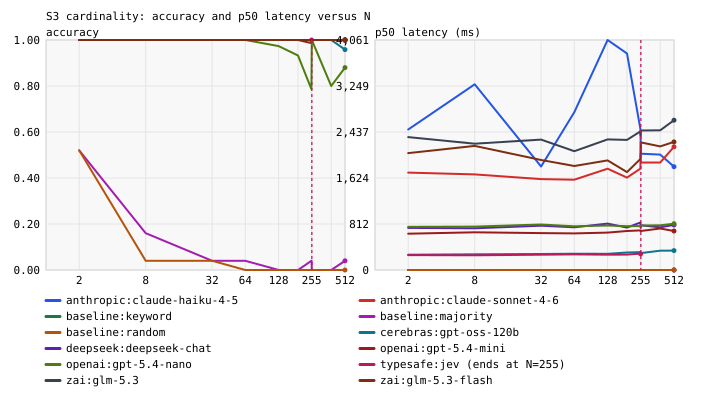

## Reliability diagrams

### baseline:keyword

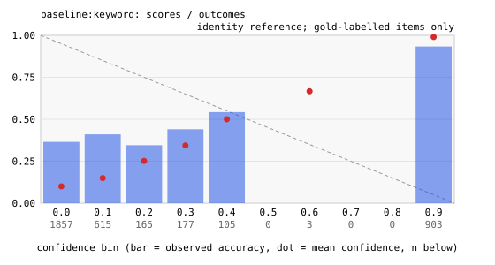

### baseline:majority

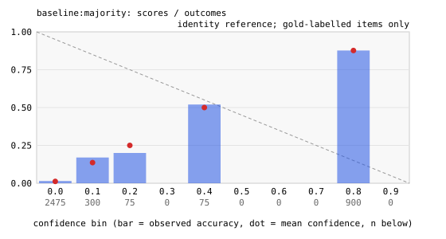

### baseline:random

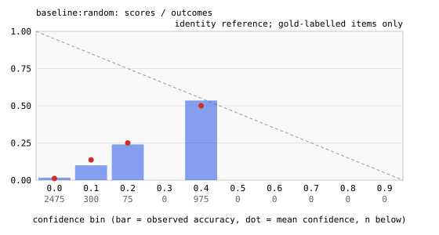

### anthropic:claude-haiku-4-5

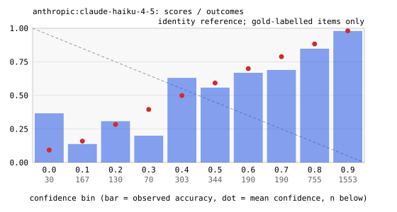

### anthropic:claude-sonnet-4-6

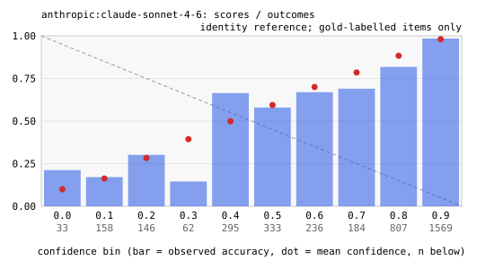

### cerebras:gpt-oss-120b

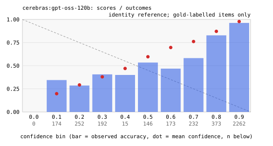

### deepseek:deepseek-chat

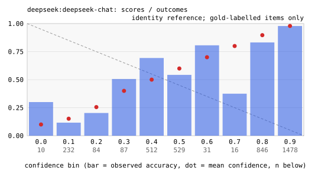

### openai:gpt-5.4-mini

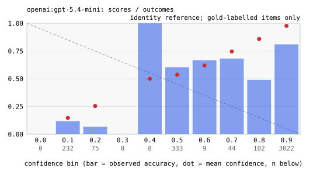

### openai:gpt-5.4-nano

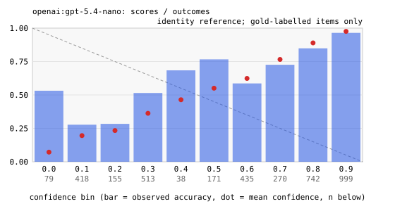

### typesafe:jev

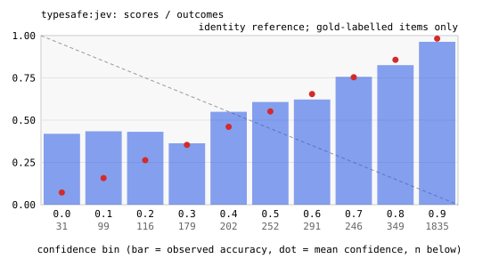

### zai:glm-5.3

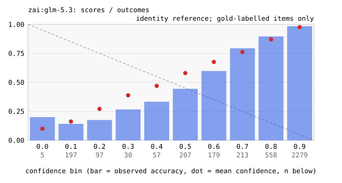

### zai:glm-5.3-flash

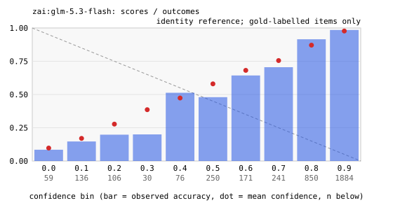

## Machine-readable cell metrics

See `v3.cells.json` next to this file.

## Data and licenses

- banking77 (S1, S4 base items): PolyAI, CC BY 4.0; intent labels
  appear in the raw logs with this attribution.
- UCI SMS spam (S2): UCI currently identifies the collection as CC BY 4.0
  (https://archive.ics.uci.edu/dataset/228/sms+spam+collection). Text stays
  local under this project's conservative publication policy.
- S3, S5 are synthetic and generated by this repository's code
  from seed 20260918.

